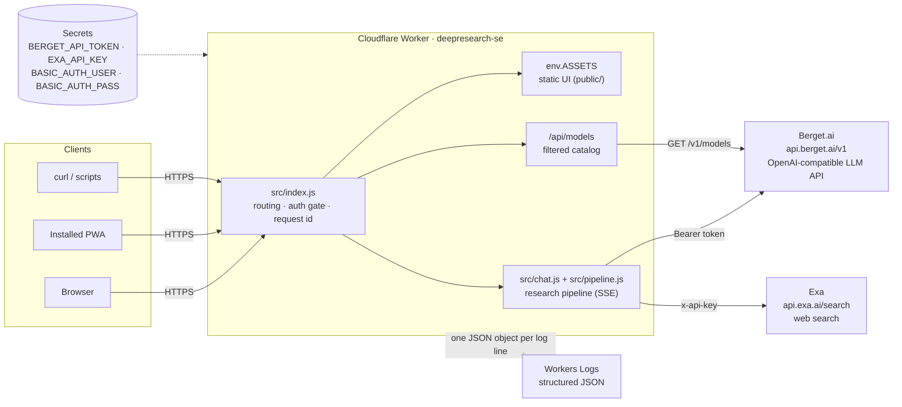
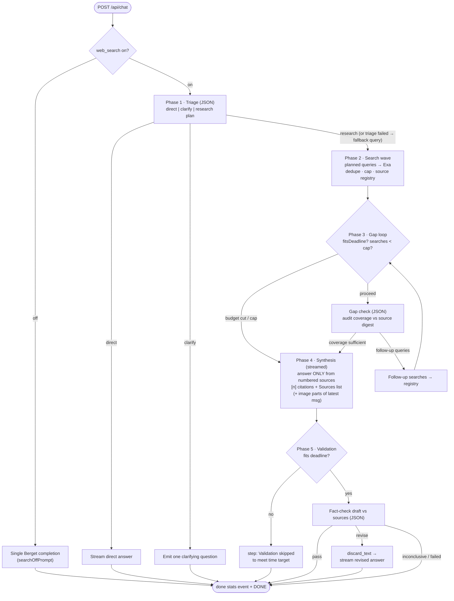

# Architecture — Deepresearch.se

Complete technical architecture of the site: a single Cloudflare Worker that
serves a static chat UI and orchestrates a deterministic, time-budgeted deep
research pipeline over Berget.ai (LLM) and Exa (web search), streamed to the
browser as SSE.

**Diagrams:** the editable data-flow diagrams live in
[`architecture.drawio`](./architecture.drawio) (open with
[diagrams.net](https://app.diagrams.net) or the VS Code Draw.io extension).
Four pages:

1. **System context & deployment** — clients, Worker modules, external APIs,
   secrets, deploy path
2. **Request routing & auth** — the decision tree every request goes through
3. **Research pipeline data flow** — the five phases, budget checks, and the
   source registry
4. **SSE stream sequence** — the event choreography between client, Worker,
   Berget, and Exa

Inline [Mermaid](https://mermaid.js.org) versions of the key flows are
embedded below so GitHub renders them directly.

---

## 1. System context

Everything runs in **one Cloudflare Worker** (`deepresearch-se`), deployed at
the edge, git-connected to this repo (push to `main` → build → deploy; also
deployable via `npx wrangler deploy`). There is no origin server, no
database, and no server-side storage of any chat content — all conversation
state lives in the browser and is resent with each request.

### External dependencies

| Service | Endpoint | Auth | Used for |
|---|---|---|---|
| Berget.ai | `POST https://api.berget.ai/v1/chat/completions` | `Authorization: Bearer BERGET_API_TOKEN` | All LLM calls: streaming completions + non-streaming JSON-mode calls |
| Berget.ai | `GET https://api.berget.ai/v1/models` | same | Model catalog (filtered, cached ~5 min/isolate) |
| Exa | `POST https://api.exa.ai/search` | `x-api-key: EXA_API_KEY` | Web search: `type:"auto"`, `numResults:5`, `contents:{highlights:true}` |

Known provider limits baked into the design:

- **Berget rejects request bodies over ~1 MB** (measured: 1.0M chars OK,
  1.2M rejected) → client-side image downscaling + server-side caps
  (`src/validation.js`).
- Default model `mistralai/Mistral-Small-3.2-24B-Instruct-2506`
  (override: `BERGET_MODEL` var). Only text models with **streaming +
  JSON mode** are usable — the pipeline's helper phases depend on
  `response_format: {type:"json_object"}`.
- Exa returns HTTP 402 without a key; all Exa failures degrade to an error
  string, never a failed request.

## 2. Deployment & configuration

`wrangler.toml`:

- `main = "src/index.js"` — the Worker script (having a `main` is also what
  unlocks secrets on the Worker; assets-only Workers can't hold them).
- `[assets] directory = "./public"`, `binding = "ASSETS"`,
  **`run_worker_first = true`** — the Worker sees *every* request, so the
  auth gate covers the static UI as well; assets are served via
  `env.ASSETS.fetch()`.
- `routes` — custom domains `deepresearch.se` and `www.deepresearch.se`.
- `[vars] LOG_LEVEL = "info"`; `[observability] enabled = true` persists
  logs to Workers Logs.
- Secrets are set only in the dashboard/CLI, never in the repo:
  `BERGET_API_TOKEN`, `EXA_API_KEY`, `BASIC_AUTH_USER`, `BASIC_AUTH_PASS`.

## 3. Request lifecycle & auth

Every request flows through `src/index.js`
(draw.io page 2 shows the full tree):

1. **Request id** — `crypto.randomUUID()`, attached to every log line and
   returned on every response as `x-request-id`.
2. **Public-asset bypass** — `GET/HEAD` for `/favicon.ico`,
   `/manifest.webmanifest`, `/icons/*` skip auth entirely. Reason: iOS
   fetches `apple-touch-icon` and Chrome downloads manifest icons *without*
   credentials; behind auth they silently 401 and the PWA icon breaks.
   Nothing sensitive is exposed — branding only.
3. **`POST /login`** — validates the form against the same secrets as Basic
   Auth; success issues the session cookie and 303-redirects to `/`.
4. **Auth gate** (`src/auth.js`) — two mechanisms, same credentials, and it
   **fails closed** (missing secrets ⇒ everything is denied):
   - **HTTP Basic Auth** — checked on every request (curl/scripts). No
     `WWW-Authenticate` challenge is ever emitted.
   - **Session cookie** `dr_session` — value `exp.hmac(exp)`,
     HMAC-SHA-256 keyed from the credential pair (so rotating the password
     invalidates all sessions), 30-day TTL, `Secure; HttpOnly; SameSite=Lax`.
     Exists because an installed PWA cannot display the native Basic Auth
     dialog (a 401 challenge renders as a black screen on iOS) — so
     unauthenticated HTML navigation gets the login page instead;
     unauthenticated `/api/*` gets a 401 JSON body.
   - Credential comparison is constant-time-ish (`safeEqual`).
5. **Routing** — `POST /api/chat` → pipeline; `GET /api/models` → catalog;
   everything else → `env.ASSETS.fetch()` (the static UI).

## 4. `POST /api/chat` — the research pipeline

### 4.1 Handler (`src/chat.js`)

A thin ~110-line shell around the pipeline:

- Parse JSON body → `validateMessages` (`src/validation.js`): roles, 60
  messages max, 32K chars/message, image caps (4/message, 8/request, 300K
  chars/image, 750K total — sized under Berget's ~1 MB body limit).
- `resolveModel`: validates a requested model against the catalog (400 on
  unknown or down models), enforces vision capability when images are
  attached (the 400 lists vision-capable alternatives), and degrades to the
  default model if the catalog is unreachable.
- `clampBudget(body.time_budget_s)` (15–600 s, default 60) and
  `web_search !== false` (knob, default on).
- Builds the per-request `state`: the budget plan, dedupe set of ran
  queries, the **numbered source registry** (`sources[]` + `byUrl` map),
  and usage totals.
- Opens a `ReadableStream` and runs `runPipeline`; the `finally` block
  *always* emits the `done` stats event and `data: [DONE]`, even after an
  error mid-stream.

### 4.2 Pipeline (`src/pipeline.js`)

The Worker orchestrates every phase directly — **no function calling**.
Every planning/validation step is a plain JSON-mode completion, so the flow
is deterministic and works on any JSON-mode model (this design replaced an
earlier tool-calling loop after Mistral emitted pseudo tool calls as text).

Phase details:

1. **Triage** (JSON, ≤500 tokens): sees the formatted conversation + latest
   message; returns `direct` | `clarify` (one question) | `research` with
   multi-angle queries (count from the budget plan). If triage fails or
   returns junk, `normalizeTriage` falls back: substantial question (≥12
   chars) → research with the raw question as the single query; otherwise
   answer directly.
2. **Search wave** (`runSearches`): each planned query → Exa. Queries are
   deduped case-insensitively (`ranQueries`), capped at `plan.maxSearches`.
   Results feed `addSources`: **deduped by URL, numbered in arrival order**
   so `[n]` citations stay stable between synthesis and validation; capped
   at `plan.maxSources`, keeping ≤3 highlights per source.
3. **Gap check** (JSON, ≤400 tokens, up to `plan.gapIterations` rounds):
   audits the source digest against the question; returns follow-up queries
   for missing angles or `complete`. Each round first passes a deadline
   check (cost of gap + 2 searches + synthesis + validation must still fit).
4. **Synthesis** (streamed): system prompt demands an answer built **only**
   from the numbered source digest, with `[n]` citations and a "Sources:"
   list, in Markdown. Image parts of the latest user message ride along
   (multimodal content) so vision models can research with the image.
5. **Post-validation** (JSON, ≤3000 tokens): fact-checks the draft against
   the same digest. `pass` → done; `revise` → the UI is told to
   **`discard_text`** (clear the streamed draft) and the corrected answer is
   emitted through the same delta path (`emitChunked`, 80-char chunks);
   inconclusive → draft kept. Skipped visibly when the budget doesn't allow
   it.

**Fail-soft invariant:** every helper phase (triage, gap check, validation)
runs through `phase()`, which catches errors, records duration into the
budget stats, logs `chat.phase` / `chat.phase_failed`, and returns `null` —
the pipeline degrades (fewer searches, skipped iteration, accepted draft)
but never fails the request. Exa failures likewise return error strings,
not exceptions.

### 4.3 Time-budget planner (`src/budget.js`)

The UI slider sends `time_budget_s`; the planner decides how to spend it.

- **Rolling stats**: an EWMA (α = 0.3) of each phase's duration
  (`triage / search / gap / synth / validate`) is kept **per model** (models
  differ several-fold in speed), seeded with priors measured on production
  runs (6.0 / 1.3 / 4.5 / 16 / 13 s). Stats live per isolate; every
  completed phase feeds `recordPhase`.
- **Static allocation** (`planResearch`), before searching begins:
  - `fixed = triage + synth` — always paid; `avail = budget − fixed`.
  - Floor: if `avail ≤` one search, run 1 query and nothing else.
  - **Validation is the quality gate** — reserved first, unless the budget
    can't hold it plus a minimal two-search plan.
  - ~60% of the remainder buys initial search angles (1–4, up to 6 at
    ≥240 s budgets).
  - What's left buys gap rounds (each ≈ gap check + 2 searches; up to 4
    rounds at ≥300 s). Bigger budgets also raise follow-ups per round
    (3→5), the search cap (up to 20), the source registry (18→24) and the
    digest size (14K→18K chars).
- **Runtime deadline checks** (`fitsDeadline`): between phases the pipeline
  re-checks that upcoming work plus remaining mandatory phases fits within
  **budget + 15% grace**. Overruns cut optional work — extra gap rounds
  first, validation last, with a visible "Validation skipped" step.

### 4.4 SSE protocol

`Content-Type: text/event-stream`; OpenAI-style deltas plus custom `status`
events. **Clients must ignore unknown status types** (forward
compatibility). Draw.io page 4 shows the full sequence.

| Event | Meaning / UI behavior |
|---|---|
| `{"choices":[{"delta":{"content":"…"}}]}` | Text chunk — append to the answer |
| `status: step_start {id, label}` | Pipeline step spinner (plan / gapN / synth / validate) |
| `status: step_done {id, label, details[]}` | Checkmark; `details` renders as an expandable list |
| `status: search_start {round, query}` | "Searching the web: …" spinner |
| `status: search_done {round, query, results, duration_ms, sources[]}` | Resolved bar with counts + expandable source links |
| `status: discard_text` | Clear the streamed draft; corrected answer follows |
| `status: done {model, rounds, searches, duration_ms, prompt_tokens, completion_tokens, co2_grams}` | Stats footer |
| `{"error":"…"}` | Shown as an error inside the bubble |
| `data: [DONE]` | Stream end (always sent, even after errors) |

## 5. `GET /api/models`

Proxies Berget's catalog filtered to `model_type === "text"` with
`capabilities.streaming && capabilities.json_mode`, mapped to
`{id, name, pricing, up, vision}` and cached ~5 min per isolate. Down models
(`status.up === false`, e.g. maintenance) are *included* with `up:false` so
the UI greys them out — they become selectable automatically when Berget
brings them back. The same cached list backs per-request model validation
in `/api/chat`.

## 6. Client architecture (`public/`)

`index.html` is 72 lines of pure markup; all styling in `css/app.css`, all
behavior in ES modules under `js/`, vendored libraries in `vendor/`
(`marked`, `DOMPurify` — **no CDN**, everything stays behind auth).

| Module | Responsibility |
|---|---|
| `js/app.js` | State + wiring: chat history (client-side only), send flow, SSE consumption → `handleEvent` dispatch, model dropdown, web-search knob, budget slider, image attach/downscale, auto-follow scrolling, privacy notice |
| `js/turns.js` | DOM for user bubbles and assistant turns (activity `
` wrapper, typing indicator, Raw/Copy tools, stats footer, `resetForRevision` for `discard_text`) |
| `js/activity.js` | Live step bars (generic steps + searches), stats rendering, end-of-run collapse into one expandable "Research process" bar |
| `js/markdown.js` | Sanitized rendering: `DOMPurify.sanitize(marked.parse(text), {FORBID_TAGS:["img"]})` — `` forbidden so answers can't fire third-party requests; all links `target=_blank rel=noopener` |
| `js/timescale.js` | Pure functions: slider position 0–100 ↔ 15 s–10 min **quadratic** scale (fine low-end granularity), human-friendly snapping (5/15/30 s), label formatting |

Client-side behaviors that matter architecturally:

- **Answers render as Markdown by default** (synthesis asks for Markdown);
  Raw toggles plain text; Copy copies the raw text. Sanitization is
  mandatory — answers can quote hostile web content.
- **Image handling**: canvas → JPEG downscale (max 1280 px, quality ladder)
  to ≤280K chars/image and ≤700K/message; images are stripped from all but
  the latest message when resending history — together staying under
  Berget's ~1 MB body limit with headroom for text.
- **Reading-safe streaming**: scrolling up during generation detaches
  auto-follow; a jump-to-latest button appears; the jump uses instant
  `scrollTop` (smooth scrolling re-triggered the scroll detector and
  detached follow again); scrolling to the bottom re-attaches.
- **Immersive reading**: scrolling well up in the content adds
  `body.immersive`, hiding the header and the input/controls so the whole
  screen is content (only the jump button stays). Returning to the bottom —
  by scrolling or the button — restores the chrome and pins to the true
  bottom. The enter threshold is the hidden chrome's height + 96 px:
  hiding the chrome grows `#chat` by exactly that height, so a smaller
  threshold would re-enter the exit band and flicker.
- **Persistence**: model selection and budget position in `localStorage`;
  privacy acknowledgement in the `dr_privacy_ack` cookie (1 year); session
  auth in the `dr_session` cookie. Chat history is memory-only — "New chat"
  or a reload clears it.

## 7. Security model

- **Fail closed**: no auth secrets configured ⇒ every request denied.
- **Two auth mechanisms, one credential pair**; cookie signatures are keyed
  from the credentials, so a password rotation is also a global logout.
- No `WWW-Authenticate` challenge (prevents the PWA black screen); APIs get
  JSON 401s, HTML navigation gets the login form.
- **Secrets never in the repo**; the Worker reads them from Cloudflare
  secret bindings only.
- **Sanitized rendering** with `` forbidden (XSS + tracking-pixel
  defense against hostile quoted web content).
- Public surface without auth is exactly: favicon, manifest, `/icons/*`.
- Timing-safe credential comparison; HMAC-SHA-256 session tokens with
  expiry; `Secure; HttpOnly; SameSite=Lax`.

## 8. Logging & observability

Structured JSON, one object per line: `{time, level, event, request_id, …}`,
level via `LOG_LEVEL` (default `info`), persisted by Workers Logs
(dashboard → Worker → Logs; live: `npx wrangler tail`).

- Event vocabulary: `request.complete` / `request.failed`, `auth.denied`,
  `login.success` / `login.failed`, `chat.phase` / `chat.phase_failed`,
  `chat.budget_cut`, `chat.complete`, `exa.search`, `exa.error`,
  `models.list` / `models.error`.
- **Privacy rule**: never log secrets or chat content. User-provided text
  (e.g. search queries) appears at `debug` only; `info`+ carries counts,
  durations, statuses, token usage.
- Correlation: every response carries `x-request-id`. On `/api/chat`,
  `request.complete` marks headers-sent; `chat.complete` (rounds, searches,
  sources, duration) marks the true end of the stream.

## 9. Data at rest — there is none

The Worker stores nothing between requests beyond per-isolate, best-effort
caches: the 5-minute model catalog and the EWMA phase-duration stats. Both
are ephemeral and reconstructible (the stats re-seed from priors). Chat
content exists only in the browser and in flight to Berget/Exa — which is
exactly what the first-visit privacy notice states.
