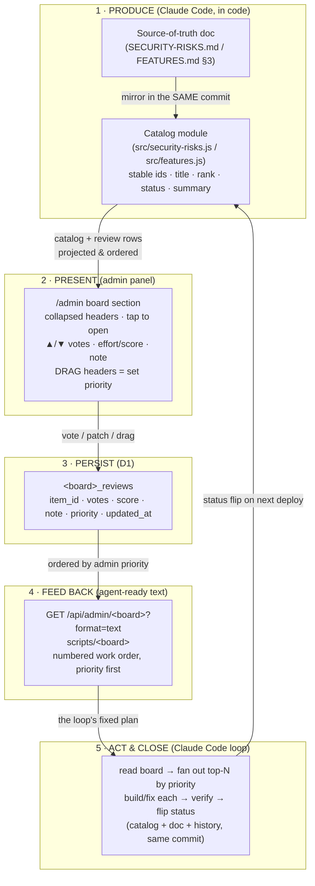
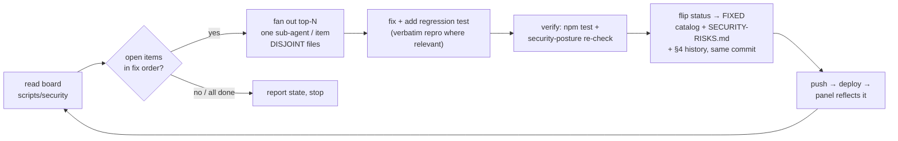
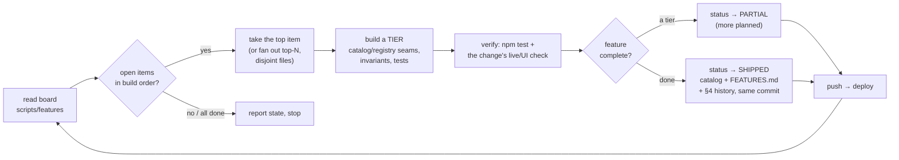

# Decision-board loops — architecture & data flows

How this project turns an admin's choices into an agent's work order, without
meetings. A **decision board** is a panel where **Claude Code produces a list,
the admin decides over it, and a Claude Code loop reads the decisions back as
its plan.** This doc is the visual companion to the **decision-boards** skill
(the mechanism) and the **feature-board** skill (implementing one). It covers
the shared architecture, the data flows for each loop, and where every piece
lives.

---

## 1. The two priority channels (plus the read-only taps)

Two boards feed a Claude Code loop with an **admin-decided priority order** —
the fixed work order the loop executes top-down:

| Channel | Source of truth | Catalog module | D1 table | Text view / CLI | Loop skill |
|---|---|---|---|---|---|
| **Security fixes** | `SECURITY-RISKS.md` §3 | `src/security-risks.js` | `security_reviews` | `scripts/security` | security-posture |
| **Feature build** | `FEATURES.md` §3 | `src/features.js` | `features_reviews` | `scripts/features` | feature-board |

Two more admin lists share the same `?format=text` + `scripts/<name>` shape but
are variants, not priority boards:

| List | Kind | Module | Text view / CLI | Loop skill |
|---|---|---|---|---|
| **Feedback queue** | dynamic user rows, dialogue threads | `src/feedback.js` | `scripts/feedback` | feedback-loop |
| **Chat logs** | read-only tap (no choices) | `src/chatlog.js` | `scripts/chatlogs` | chat-logs |

All of them are discoverable in one call — `scripts/boards` /
`GET /api/admin/boards?format=text` (registry: `src/admin-boards.js`).

---

## 2. The generic board ⇄ loop cycle

Every priority board is the same machine over a different catalog. The cycle:



The board core `src/board.js` implements steps 2–4's shared half: choice-state
validation, the two orderings (`orderBoardItems`), and the D1 review-row
helpers (`loadBoardReviews`, `voteBoardRow`, `patchBoardRow`). A board's own
module keeps only what is item-shaped.

**Key invariant:** the D1 review rows are keyed by the catalog's **stable item
ids**, so editing the catalog (rewording, shipping, adding items) never orphans
the admin's votes/notes/priority. Ids are forever.

---

## 3. Request-level data flow (one board, live)

What actually crosses the wire when the admin opens a board and when the loop
reads it. Both go through the admin gate in `index.js` → `admin-api.js`
dispatch → the board's handler.

```mermaid
sequenceDiagram
    autonumber
    participant Admin as Admin (browser<br/>public/js/admin.js)
    participant Worker as Worker<br/>index.js → admin-api.js
    participant Board as Board handler<br/>src/features.js
    participant Core as src/board.js
    participant D1 as D1 &lt;board&gt;_reviews
    participant Loop as Claude Code loop<br/>scripts/features

    Note over Admin,D1: Admin curates the board
    Admin->>Worker: GET /api/admin/features?order=priority
    Worker->>Board: handleAdminFeatures()
    Board->>Core: loadBoardReviews(db, "features_reviews")
    Core->>D1: SELECT * FROM features_reviews
    D1-->>Core: review rows
    Board->>Core: orderBoardItems(catalog+rows, "priority", impactRank)
    Core-->>Board: build order
    Board-->>Admin: { items: [...], order, count }
    Admin->>Admin: render collapsed headers (tap to open)

    Admin->>Worker: (drag headers) PATCH /features/F-3 { priority: 1 }
    Worker->>Board: handleAdminFeatures()
    Board->>Core: patchBoardRow(db, "features_reviews", "F-3", {priority:1})
    Core->>D1: UPSERT
    Board-->>Admin: { item: F-3 (priority 1) }

    Note over Loop,D1: Later — the loop reads the admin's order
    Loop->>Worker: GET /api/admin/features?format=text (break-glass auth)
    Worker->>Board: handleAdminFeatures()
    Board->>Core: load + order (priority)
    Board-->>Loop: FEATURE BUILD ORDER (numbered, top-down)
    Loop->>Loop: build top-N in that fixed order
```

---

## 4. What each loop *does* — its work cycle

The two priority loops share a skeleton but differ in what "act" means. Both are
**human-in-the-loop by construction**: the decision already happened on the
board, so the loop needs no per-item approval round-trip.

### 4a · Security-fix loop (`scripts/security`, security-posture skill)



Input = the register's §3 backlog ordered by the admin's priority. Output =
merged fixes, each item's status flipped in the same commit as the work. An
`🔁 OPERATIONAL` item (e.g. a provider-console cap) is recorded and reported,
never silently closed — the board is a truth surface.

### 4b · Feature-build loop (`scripts/features`, feature-board skill)



Input = `FEATURES.md` §3's backlog ordered by the admin's priority (the order
the admin dragged the headers into). Output = shipped tiers, each flipping the
catalog `status` (`open → PARTIAL → SHIPPED`, or `DROPPED`) in the same commit
as the work, plus the §3 tag and a §4 history line.

### 4c · Feedback loop (variant — dynamic queue, per-entry decision)

Not a code catalog: rows are user-created, the "choice" is a status lifecycle
plus a dialogue reply. Every entry gets a human decision before the agent acts;
the agent messages back in plain language. See the feedback-loop skill.

---

## 5. Where the pieces live

```
Source of truth   SECURITY-RISKS.md §3        FEATURES.md §3
        │  mirror (same commit)                       │
Catalog  src/security-risks.js         src/features.js
        │  re-exports (façade)                        │
Board core  ─────────────  src/board.js  ─────────────
        │  validation · orderBoardItems · D1 helpers
Schema      src/db.js  (security_reviews, features_reviews)
Routing     src/admin-api.js  → handleAdmin{Security,Features}
Discovery   src/admin-boards.js  (ADMIN_BOARDS) → GET /api/admin/boards
Panel       public/admin/index.html  +  public/js/admin.js
            (shared board UX: collapsed headers, tap-to-open,
             pointer drag reorder → priority — wireBoardItemToggle,
             enableBoardReorder)
Panel CSS   public/css/admin.css  (.board / .board-item / .board-detail /
             .grip / .caret; sev-* and imp-* rank badges)
CLI         scripts/security   scripts/features   scripts/boards
Loop skills security-posture   feature-board      (feedback-loop, chat-logs)
```

Adding a **third** priority board is the same nine steps (catalog module → D1
table → route → panel section → CLI → discovery entry → tests → docs → the loop
skill) — see the **feature-board** skill, which walks the checklist end to end
using this board as the worked example.
