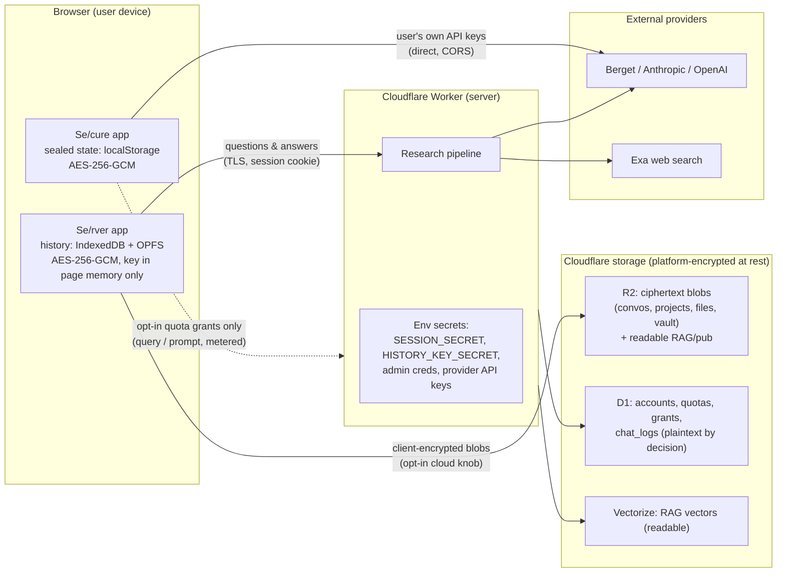
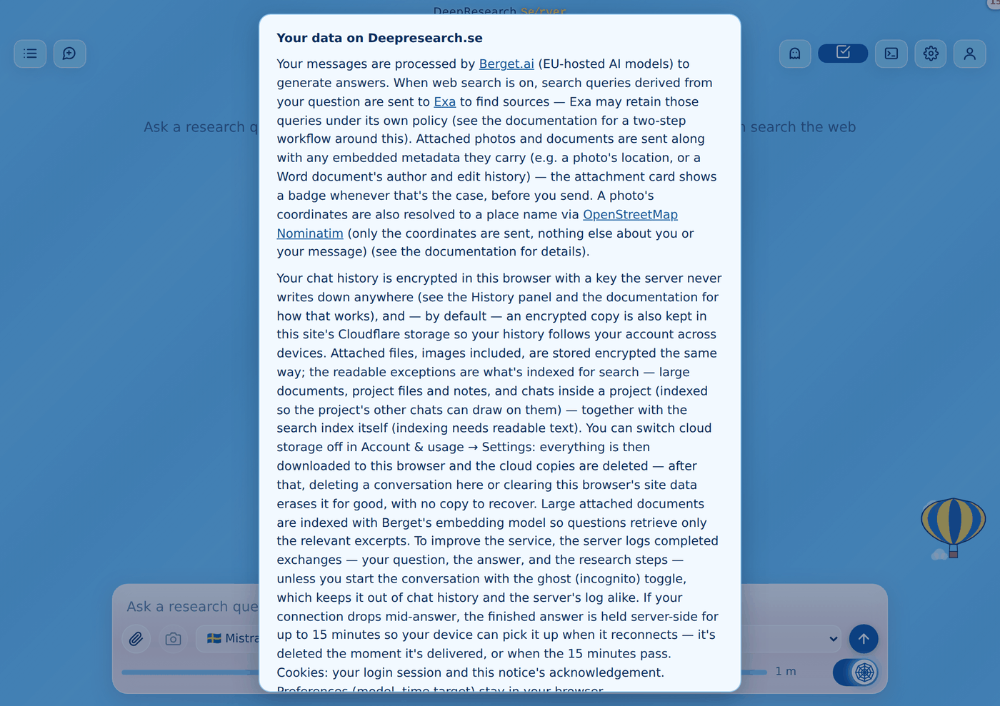
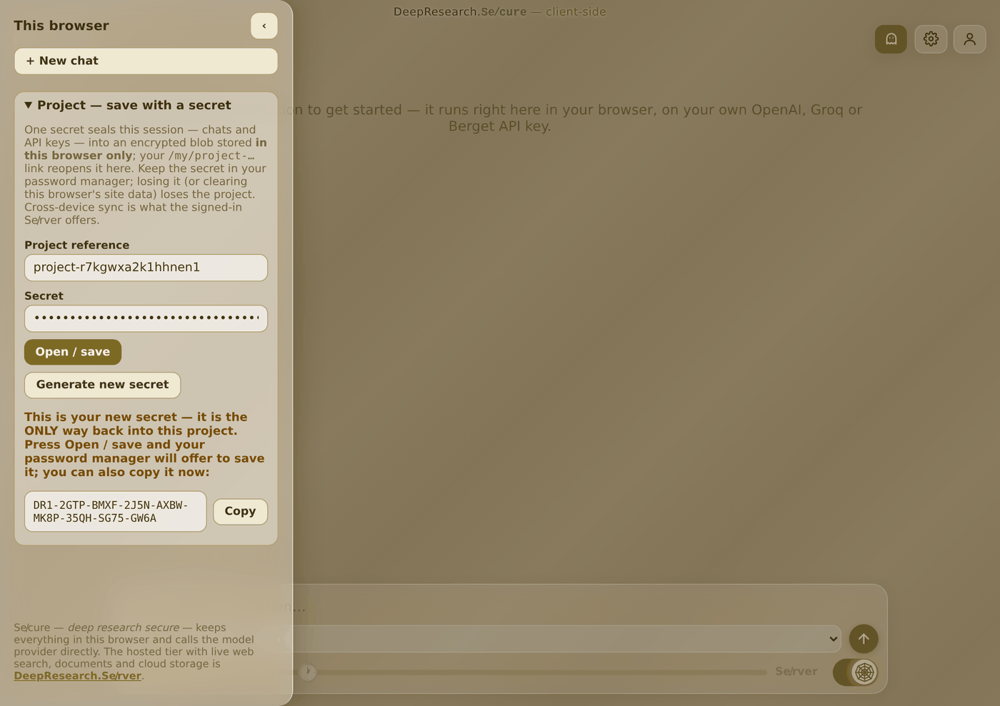
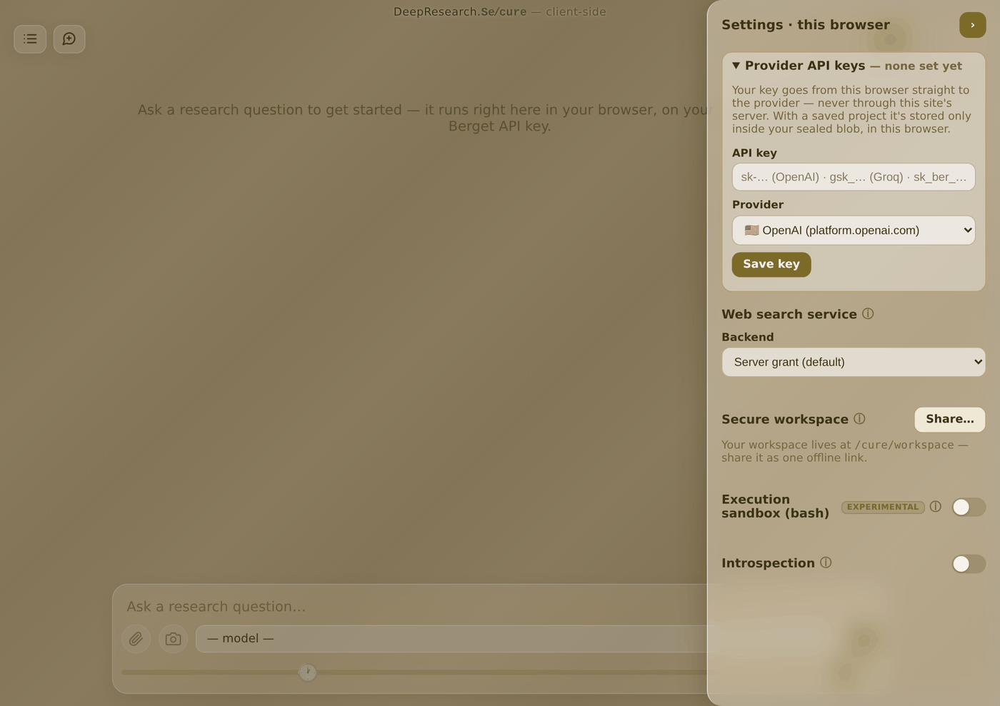
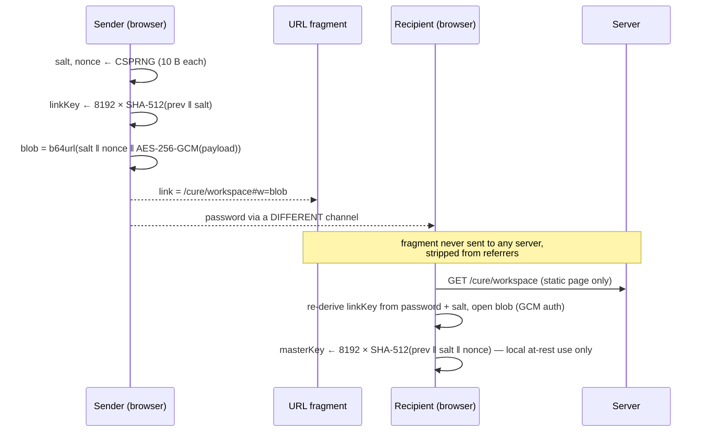
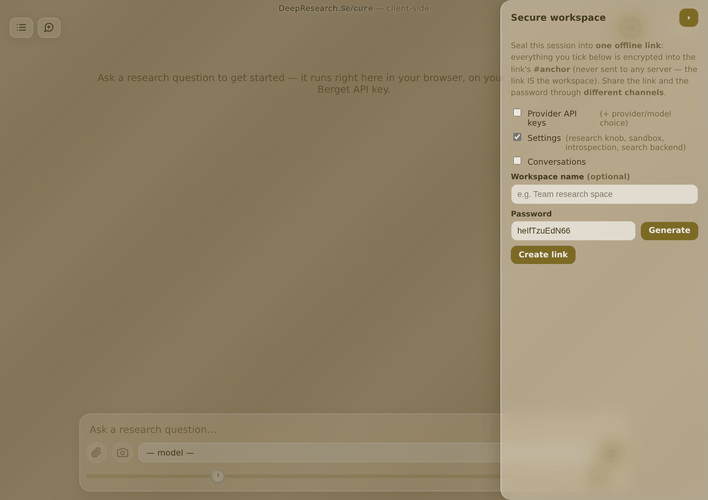

# Encryption & Key Management — Architecture Reference

*Status: **draft for review** (2026-07-15). Written for cybersecurity
professionals assessing this architecture. Every normative statement in this
document carries a claim ID (**E-1** … **E-38**, §12) anchored to the exact
source file that implements it, so the document can be independently
validated against the code — see §13 for the validation protocol. The whole
codebase is public, so nothing here relies on secrecy of design.*

---

## Contents

1. [Executive summary](#1-executive-summary)
2. [System context & trust boundaries](#2-system-context--trust-boundaries)
3. [Cryptographic primitive inventory](#3-cryptographic-primitive-inventory)
4. [Root secrets](#4-root-secrets)
5. [Key derivation, subsystem by subsystem](#5-key-derivation-subsystem-by-subsystem)
6. [Data at rest — the full matrix](#6-data-at-rest--the-full-matrix)
7. [Deliberate plaintext surfaces](#7-deliberate-plaintext-surfaces)
8. [Data in transit](#8-data-in-transit)
9. [Randomness, IVs and nonce management](#9-randomness-ivs-and-nonce-management)
10. [Failure-mode contract](#10-failure-mode-contract)
11. [Known limitations & accepted risks](#11-known-limitations--accepted-risks)
12. [Claims register](#12-claims-register)
13. [Validation protocol](#13-validation-protocol)

---

## 1. Executive summary

DeepResearch.se is a Cloudflare Worker serving two product tiers with
deliberately different trust models:

- **DeepResearch.Se/cure** (`/cure`) — the client-side tier. No accounts. The
  server serves static files and is in **no data path**: model calls go
  browser→provider on the user's own API keys, and all state (conversations,
  settings, **the API keys themselves**) rests in browser storage as
  AES-256-GCM ciphertext under keys derived client-side from a user-held
  secret the server never sees.
- **DeepResearch.Se/rver** (`/rver`) — the signed-in tier. The server
  orchestrates the research pipeline, so conversation content transits the
  server by necessity. At rest, conversations and attached-file originals are
  ciphertext in both the browser (IndexedDB/OPFS) and, when the opt-in cloud
  knob is on, Cloudflare R2 — encrypted **client-side** under a per-user key
  that is derived server-side on demand but **never stored at rest anywhere**.

Five properties define the architecture, in decreasing order of strength:

| # | Property | Where |
|---|---|---|
| 1 | **Server cryptographically excluded** — server never sees secret, key, or plaintext; could not decrypt even under full compromise | Se/cure sealed state, project vault, workspace links |
| 2 | **Key never at rest** — ciphertext rests in browser/R2; the key exists only in server env-secret (derivable) + browser page memory | Se/rver chat history, projects, attached files |
| 3 | **Integrity-only (no confidentiality needed)** — HMAC-signed bearer tokens; claims are readable by design, unforgeable, quota-metered server-side | Session cookies, OAuth state, grant/proxy tokens |
| 4 | **Platform baseline** — Cloudflare-managed at-rest encryption of R2/D1/Vectorize; not application crypto | Everything on Cloudflare storage |
| 5 | **Deliberately readable** — enumerated, disclosed exceptions where a feature requires plaintext (RAG indexing, the interaction log, public replays) | §7 |

All application cryptography uses **WebCrypto primitives only** — AES-256-GCM
for confidentiality, HMAC-SHA-256 for integrity, HKDF-SHA-256 for key
derivation (plus one provenance-mandated iterative-SHA-512 KDF, §5.5). There
are **no third-party crypto dependencies** anywhere in the stack (a standing
project invariant), no hand-rolled ciphers, and no non-CSPRNG randomness in
any security-relevant path.

The most important honest caveats an assessor should weigh (full list §11):
the Se/rver history key is *derivable* by a live, compromised server
(property 2 is "key never at rest", not "server can never know the key" —
disclosed to users); the interaction log stores full Q&A plaintext in D1
unless the conversation is flagged incognito (an explicit product decision);
and the workspace-link KDF is iterative SHA-512, not a memory-hard KDF, by
provenance-cloning mandate.

---

## 2. System context & trust boundaries



**Trust boundary summary.** In Se/cure, the trust boundary is the browser
itself: the server is structurally outside every data path (the two bounded
exceptions — opt-in, quota-metered web-search and LLM-proxy grants — are
documented in §5.6 and disclosed in the UI). In Se/rver, content transits the
server in memory during a request; the at-rest design ensures the server
*stores* only ciphertext it cannot read from storage alone, with the
enumerated exceptions of §7.

The user-facing disclosure of this model is shown on first sign-in — it is
deliberately specific about the encryption model, the readable exceptions,
and the interaction log:



---

## 3. Cryptographic primitive inventory

Every cryptographic mechanism in the application layer, exhaustively:

| Primitive | Parameters | Used for | Implementation |
|---|---|---|---|
| **AES-256-GCM** | 256-bit keys, 12-byte IV, 16-byte tag, WebCrypto `crypto.subtle` | All content encryption: chat history, files, vault archives, Se/cure sealed state, workspace links, proxy bundles | `public/js/history-store.js`, `public/js/vault-core.js`, `public/js/workspace-core.js`, `public/js/proxy-bundle.js` |
| **HMAC-SHA-256** | Key = env secret (raw UTF-8 import), hex tag | Session cookies, OAuth state, all three grant-token families; per-user history-key derivation | `src/token-crypto.js`, `src/auth.js`, `src/history-key.js` |
| **HKDF-SHA-256** | Salt = 32 zero bytes (see §9), domain-separating `info` strings | Deriving locator IDs + AES keys from the 160-bit DR1 user secrets (vault, Se/cure profile) | `public/js/vault-core.js`, `public/js/drc-core.js` |
| **Iterative SHA-512 KDF** | 8192 rounds, full 64-byte state per round, sliced to 32 | Workspace-link key derivation (provenance clone of hacka.re, §5.5) | `public/js/workspace-core.js` |
| **SHA-256** | First 8 hex chars of digest | Workspace local-storage namespace (non-secret label) | `public/js/workspace-core.js` |
| **CSPRNG** | `crypto.getRandomValues` / `crypto.randomUUID` | All secrets, keys, IVs, salts, nonces, token IDs, OAuth state | everywhere (§9) |
| **Constant-time compare** | XOR-accumulate over equal-length strings | All HMAC tag and Basic-auth credential comparisons | `src/token-crypto.js` `safeEqual` |

**Not present, by design:** no password hashing (no passwords exist — sign-in
is Google OIDC only; the break-glass Basic-auth secret is an env secret, not a
stored hash); no RSA/ECDSA application signatures (Google's ID-token
signatures are validated in the OIDC flow); no third-party crypto libraries.

---

## 4. Root secrets

Everything below derives from one of these roots. "At rest" means written to
disk-backed storage in any form.

| Root secret | Held by | At rest? | Derives / protects | Rotation impact |
|---|---|---|---|---|
| `SESSION_SECRET` | Worker env secret (Cloudflare-encrypted) | Cloudflare secret store only | ALL HMAC token families (§5.1): session cookies, OAuth state, `wsk1`/`prg1`/`prx1` grant tokens | Invalidates every session and every outstanding grant token immediately. No key versioning — one key, fail-closed. |
| `HISTORY_KEY_SECRET` | Worker env secret | Cloudflare secret store only | Per-user history keys: `HMAC-SHA-256(secret, "history-key.v1." + userId)` (§5.2) | All existing browser/R2 ciphertext becomes undecryptable (records skipped, counted, never crash) |
| `ADMIN_USER` / `ADMIN_PASS` | Worker env secrets | Cloudflare secret store only | Break-glass Basic auth; independent of `SESSION_SECRET` | Break-glass access only; no data impact |
| Provider API keys (Berget, Anthropic, OpenAI, Exa, Google Maps, Shodan, HF) | Worker env secrets | Cloudflare secret store only | Outbound API calls only; never sent to any browser | Service availability only |
| **DR1 vault secret** | **User** (password manager / paper) | Never server-side, in any form | Vault locator ID + archive key via HKDF (§5.3) | No rotation — the secret *is* the identity; loss = data loss, by design |
| **DR1 Se/cure master secret** | **User** | Never server-side | Public ref hash, blob ID, blob key via HKDF (§5.4) | Same |
| **Workspace password** | **Users sharing a link** (out-of-band) | Never in the link, never server-side | Link key + local master key via iterative KDF (§5.5) | Re-seal with a new password → new, unlinkable blob |
| Per-user history key (derived) | Browser **page memory only** — fetched per page load over an authenticated `GET /api/history-key` | **Never** (not localStorage, not IndexedDB, not sessionStorage) | AES-256-GCM over history/projects/files | Re-fetched every page load; nothing to rotate client-side |
| Proxy-bundle key (ephemeral) | URL **anchor** (`#rk=`) — never sent to any server | Never | One AES-256-GCM bundle seal (§5.6) | Fresh random key per bundle |

---

## 5. Key derivation, subsystem by subsystem

### Key-hierarchy overview

```mermaid
flowchart TB
    subgraph SRV["Server-side roots (Worker env secrets)"]
        SS["SESSION_SECRET"]
        HKS["HISTORY_KEY_SECRET"]
    end
    subgraph USR["User-held roots (never server-side)"]
        DR1V["DR1 vault secret (160-bit CSPRNG)"]
        DR1C["DR1 Se/cure master secret (160-bit CSPRNG)"]
        WPW["Workspace password (12+ alnum, ~71 bits)"]
    end

    SS -->|"HMAC ns: (cookie msg)"| SC["Session cookie u.uid.exp.tag"]
    SS -->|"HMAC ns: state."| OS["OAuth state cookie"]
    SS -->|"HMAC ns: websearch."| WSK["wsk1 web-search grant"]
    SS -->|"HMAC ns: proxygrant."| PRG["prg1 proxy grant"]
    SS -->|"HMAC ns: proxytoken."| PRX["prx1 proxy token"]

    HKS -->|"HMAC('history-key.v1.'+uid)"| HK["Per-user history key<br/>AES-256-GCM, memory-only"]

    DR1V -->|"HKDF info: vault id v1 (160 b)"| VID["Vault locator id"]
    DR1V -->|"HKDF info: vault key v1"| VK["Vault AES-256-GCM key"]

    DR1C -->|"HKDF info: free ref v1 (80 b)"| REF["Public project reference"]
    DR1C -->|"HKDF info: free blob id v1 (160 b)"| BID["Sealed-state blob id"]
    DR1C -->|"HKDF info: free blob key v1"| BK["Sealed-state AES-256-GCM key"]

    WPW -->|"8192 × SHA-512(prev‖salt)"| LK["Link key (opens the blob)"]
    WPW -->|"8192 × SHA-512(prev‖salt‖nonce)"| MK["Master key (local at-rest only,<br/>never transmitted)"]
```



### 5.1 HMAC token families (`SESSION_SECRET`)

One HMAC-SHA-256 key (`SESSION_SECRET`, imported raw) signs five mutually
unforgeable token families. Family separation is by **message namespace**: the
tag is computed over `<namespace> + <message>`, and each family verifies only
its own namespace, so a valid token of one family can never verify as another
(`src/token-crypto.js` `sign`; pinned by `token-crypto.test.js`).

| Family | Wire format | Namespace | Signed message | Claims / content | Lifetime | Metering |
|---|---|---|---|---|---|---|
| Session cookie | `dr_session=u.<uid>.<exp>.<tag>` | *(none — legacy-shaped message)* | `<uid>.<exp>` | uid, expiry | 365 d, sliding (re-issued past half-life); `Secure; HttpOnly; SameSite=Lax` | User row re-checked against D1 on every request — disable is immediate |
| OAuth state | cookie `<state>.<tag>`; `state` = 32 hex chars (16 CSPRNG bytes) | `state.` | `state.<state>` | CSRF nonce only | Single use, short TTL | — |
| Web-search grant | `wsk1.<b64url(JSON)>.<tag>` | `websearch.` | the payload | `{jti, uid, quota, iat, exp}` | Config TTL | D1 `websearch_grants` row keyed by `jti`; atomic `UPDATE … WHERE used < quota` |
| Proxy grant ("token-granting token") | `prg1.<b64url(JSON)>.<tag>` | `proxygrant.` | the payload | `{jti, uid, svc: web\|api, quota, iat, exp}` | Config TTL | D1 `proxy_grants` row |
| Proxy token (working credential) | `prx1.<b64url(JSON)>.<tag>` | `proxytoken.` | the payload | same claims, same `jti` | Config TTL | same row |

Design points an assessor should note:

- **Tokens are integrity-protected, not encrypted.** Claims are readable by
  anyone holding the token — deliberate: they contain no content, only IDs,
  quota numbers and timestamps. Confidentiality of the *transport* of grant
  tokens is handled separately (§5.6).
- **Verification order is signature-first, then expiry** — a forged token
  never reaches the D1 meter (`src/websearch-key.js`, `src/proxy-grant.js`).
- **Tag comparison is constant-time** (`safeEqual`).
- **Tokens are bearer capabilities but cannot self-meter**: the quota counter
  lives in a D1 row keyed by the token's `jti`. Deleting the row revokes the
  token instantly; no D1 → HTTP 503, so unmetered spend is impossible
  (fail-safe, §10).
- **Two-tier proxy design**: the `prg1` grant travels in URLs (inside an
  encrypted bundle); the client exchanges it (`POST /api/proxy/exchange`) for
  the `prx1` working token, which **never appears in a URL** — a leaked link
  alone never carries the working credential.
- **Fail-closed**: with `SESSION_SECRET` unset there is no signing key at all;
  the entrypoint serves a configuration-error page rather than running any
  auth flow keyless. A previous weaker design (fallback key derived from admin
  credentials) was found and removed; cookie integrity is now bounded solely
  by `SESSION_SECRET`'s entropy (`src/auth.js` header comments).

### 5.2 Se/rver chat history — the per-user history key

**The design goal:** the browser encrypts its own chat history so that
neither an offline copy of the browser's storage nor the server's storage
alone can read a conversation.

**Derivation** (`src/history-key.js`):

```
historyKey(user) = HMAC-SHA-256( HISTORY_KEY_SECRET, "history-key.v1." + userId )   // 256 bits, base64
```

Deterministic — the same signed-in identity always re-derives the same key,
so no key ever needs storing. The browser fetches it once per page load over
the authenticated `GET /api/history-key` and holds it **only in a module-level
variable** (`public/js/history-store.js`) — never written to localStorage,
sessionStorage or IndexedDB.

**Encryption** (`public/js/history-store.js`): AES-256-GCM, fresh 12-byte
CSPRNG IV per record. Two stored shapes:

- JSON records (conversations, project records): `{iv: b64, ciphertext: b64}`.
  Titles live **inside** the ciphertext (they reveal topic).
- Raw-byte form (attached-file originals): `IV ‖ ciphertext` as one opaque
  blob, stored in OPFS and mirrored to R2 as-is.

**Threat model, stated precisely** (also user-disclosed at `/help/`):

| Adversary | Gets | Reads content? |
|---|---|---|
| Offline browser-storage extraction (stolen device, disk image) | Ciphertext only — the key was never at rest | **No** |
| Server storage dump (R2/D1 at rest) | Ciphertext blobs + `HISTORY_KEY_SECRET` is *not* in R2/D1 (it's a Worker secret) | **No** |
| Live server compromise (can read env secrets) | Can **derive any user's key on demand**, but holds no ciphertext unless the user's cloud knob is on | **Only with the cloud knob on**, or combined with access to that browser's storage |

That last row is the honest limitation: this is a **"combination required"**
model, not end-to-end encryption — see §11-1.

**Cloud mirror (opt-in `server_history` knob):** the *same* ciphertext blob is
PUT to R2 (`convos/{uid}/{id}`, `projects/{uid}/{id}` — `src/storage.js`); the
server stores, lists and serves it back without ever holding key material at
rest. Attached files carry an `x-file-enc` header so the server knows which
stored form it has without being able to tell the contents. Flipping the knob
off triggers the drain: the client pulls everything down and deletes the
server copies.

### 5.3 The project vault — user-held secret, server as blind blob store

The strictest Se/rver tier: a whole project (record, chats, decrypted file
originals, RAG index with vectors) packed into ONE archive the server only
ever sees encrypted, under a secret **the server never sees and cannot
derive** (`public/js/vault-core.js`, orchestration `public/js/vault.js`,
server endpoint `src/vault.js`).

**The secret:** `DR1-` + 8 groups of 4 Crockford-base32 chars = **160 bits
from `crypto.getRandomValues`**. Copy-safe by construction: case-insensitive,
separators ignored, and classic transcription misreads mapped back on input
(O→0, I/L→1) — a secret read over the phone still works. The `DR1` prefix is
a format marker, not entropy.



**Derivation — the secret is the whole key hierarchy:**

```
IKM   = decodeCrockford(secret)                      // 160 uniform CSPRNG bits
salt  = 32 zero bytes                                 // justified: IKM is already uniform (§9)
id    = HKDF-SHA-256(IKM, salt, info="deepresearch.se vault id v1",  160 bits)  → Crockford, the R2 locator
key   = HKDF-SHA-256(IKM, salt, info="deepresearch.se vault key v1", 256 bits)  → AES-256-GCM, non-extractable
```

Knowing the secret is *both* finding the blob and decrypting it; the two
outputs are cryptographically independent (HKDF domain separation), so the
storage ID reveals nothing about the key. The info strings are **frozen** —
changing them breaks every stored secret.

**The blob:** `12-byte IV ‖ AES-256-GCM ciphertext(JSON archive)` — wire form
and stored form are the same bytes. Server-side it rests at R2
`vault/{uid}/{id}` behind the normal authenticated session (the server knows
*which user* stored *a* blob, but not what's in it or how to find it without
the secret-derived ID). GCM authentication means tamper or wrong-key is a
hard decrypt failure, never garbage output.

### 5.4 Se/cure (client-side tier) — the master secret profile

Se/cure reuses the vault primitives verbatim — same secret format, same
CSPRNG routine, same HKDF pattern, same seal format — with **three**
independent outputs (`public/js/drc-core.js`):

| Output | HKDF info string | Size | Role |
|---|---|---|---|
| `refHash` | `"deepresearch.se free ref v1"` | 80 bits | The **public** project reference — the `<hash>` in `/my/project-<hash>` and the username the password manager files the secret under. A bookmark label, deliberately **not a capability**: knowing it grants nothing. |
| `blobId` | `"deepresearch.se free blob id v1"` | 160 bits | The localStorage key the sealed state rests under (`public/js/drc-store.js`) |
| `blobKey` | `"deepresearch.se free blob key v1"` | 256 bits | AES-256-GCM key sealing the state |

(The `free` in the info strings predates the Se/cure name; they are frozen
derivation constants.)

The sealed state contains **everything** the tier persists — conversations,
settings, the client-side RAG index (chunk text *and* vectors), and **the
user's provider API keys**. None of it ever leaves the browser; the seal is
the vault's `12-byte IV ‖ AES-256-GCM` format. Unit tests pin that every
derived value is independent of every other *and* of the vault derivation for
the same secret (`drc-core` test suite).



### 5.5 Secure workspace links — the hacka.re-cloned link crypto

A workspace is a fully configured Se/cure session sealed into **one offline
link**: `…/cure/workspace#w=<blob>`. The blob rides the URL **fragment**,
which browsers never send in HTTP requests and strip from referrers — so the
server (and any intermediary) never sees even the ciphertext. Architecture
doc: `docs/WORKSPACE-SECURITY.md`; implementation
`public/js/workspace-core.js`.

The mechanism is cloned element-for-element from the owner's prior project
[hacka.re](https://github.com/kristerhedfors/hacka.re) (an explicit
provenance mandate), with exactly one substitution:

```
blob      = base64url( salt(10) ‖ nonce(10) ‖ AES-256-GCM ciphertext )
linkKey   = ( SHA-512 iterated 8192×: state ← SHA-512(state ‖ salt)        )[0:32]
masterKey = ( SHA-512 iterated 8192×: state ← SHA-512(state ‖ salt ‖ nonce))[0:32]   // never transmitted
GCM IV    = SHA-512(nonce)[0:12]                                            // nonce expansion, as in the original
namespace = SHA-256(blob)[0:8 hex]                                          // local-storage label, non-secret
password  = 12 alphanumeric chars (~71 bits) generated, or user-chosen; shared OUT-OF-BAND, never in the link
```

The substitution: hacka.re's XSalsa20-Poly1305 (TweetNaCl) becomes
**AES-256-GCM**, because this repo ships no crypto dependency and WebCrypto
has no Salsa — both are AEADs, and the 10-byte stored nonce is expanded by a
single SHA-512 exactly as the original does (24 bytes for NaCl there, 12 for
GCM here).



**Dual-key rationale:** the link key opens the blob; the *master* key —
derivable only by someone who can already open the link — is reserved for
encrypting the opened workspace at rest locally, so nothing on the
recipient's disk is decryptable from the link blob alone.

Fresh salt + nonce per seal means the same workspace sealed twice yields two
unlinkable blobs. Opening is fail-soft: wrong password, tampered ciphertext,
malformed anything → `null`, never an exception (§10).

A workspace may carry the quota-bound grant tokens of §5.1 — these stay
live-governed server-side (quota adjustable per token, row revocable) even
though the link itself is immutable.



**Assessor note:** the KDF is deliberately *not* Argon2/scrypt/PBKDF2 — see
§11-2 for the reasoning and compensating controls.

### 5.6 Proxy bundle — ciphertext in the query, key in the anchor

The grant bundle (§5.1's `prg1` tokens, one per service) must reach a Se/cure
browser via a URL without the server-visible part being readable
(`public/js/proxy-bundle.js`):

```
key  ← 32 CSPRNG bytes            (fresh per bundle — two bundles never share key material)
iv   ← 12 CSPRNG bytes
blob = b64url( iv ‖ AES-256-GCM(JSON bundle) )

URL  = …/cure?rp=<blob>#rk=<b64url(key)>
```

The **ciphertext** rides the query string (`?rp=` — server-visible but
opaque); the **key** rides the anchor (`#rk=` — never sent to any server,
stripped from referrers). A leaked server log or Referer header therefore
carries a blob it can never open. The client reads both halves from its own
address bar, decrypts, then exchanges each grant token for a working `prx1`
token that never appears in any URL.

---

## 6. Data at rest — the full matrix

Every persistent store in the system, what form data takes, and who can read
it. "Platform" = Cloudflare's transparent at-rest encryption (baseline for
everything in R2/D1/Vectorize; not application crypto and not counted as such
here).

### Browser-side stores

| Store | Contents | Form | Key | Readable by |
|---|---|---|---|---|
| IndexedDB `dr_history` (Se/rver) | Conversations, project records | `{iv, ciphertext}` AES-256-GCM | Per-user history key (memory-only) | The signed-in user's live page. **Exception:** project chats rest readable `{data}` (§7-2) |
| OPFS `originals/` (Se/rver) | Attached-file original bytes | `IV ‖ ciphertext` | Same history key | Same. **Exception:** RAG-indexed documents rest readable (§7-2) |
| IndexedDB `dr_rag` (Se/rver) | RAG chunks + vectors, file metadata rows (name/type/size) | **Readable** | — | Anyone with the browser profile (§7-2) |
| localStorage (Se/cure) | The whole sealed state: chats, settings, RAG index, **provider API keys** | `IV ‖ ciphertext` AES-256-GCM, keyed by the derived 160-bit `blobId` | `blobKey` from the user's DR1 master secret | **Only the secret holder** — server excluded by construction |
| localStorage flags (both tiers) | UI preferences (`dr_dev_mode`, intro-seen flags, …) | Readable | — | Non-sensitive by policy: booleans/counters only, no content |

### Server-side stores

| Store | Contents | Form | Server can read? |
|---|---|---|---|
| R2 `convos/{uid}/{id}`, `projects/{uid}/{id}` | Cloud mirror of history/project records (opt-in knob) | The client's `{iv, ciphertext}` blob, verbatim | **No** — key never at rest server-side (live derivation caveat §11-1). Exception: project chats `{data}` (§7-2) |
| R2 `files/{uid}/{fileId}` | Attached-file originals (opt-in knob) | Client's stored form, `x-file-enc` flag: ciphertext for ordinary files, **readable for RAG-indexed documents** | Only the RAG-indexed class (§7-2) |
| R2 `vault/{uid}/{id}` | Project-vault archives | `IV ‖ ciphertext` under the user-held DR1 secret | **No — cryptographically excluded** (server never sees secret or key) |
| R2 `rag/{uid}/{docId}` | Exportable RAG index copies | **Readable** | Yes (§7-2) |
| R2 `pub/{slug}` | Published research replays | **Readable** | Yes — public by intent (§7-4) |
| D1 `users`, `usage`, `settings_json` | Accounts (Google-provisioned, **no passwords**), quotas, knobs | Readable | Yes — operational data, no conversation content |
| D1 `chat_logs` | **Full Q&A + research metadata per exchange** | **Readable** | Yes — explicit product decision; suppressed for incognito (§7-1) |
| D1 `answers` | Answer-recovery buffer for dropped connections | Readable | Yes — transient: deleted on client ack, purged ≤ 15 min (§7-5) |
| D1 `websearch_grants`, `proxy_grants` | Grant quota meters | Readable | Yes — IDs/counters only, no content, no token material (tokens are not stored, only their `jti`) |
| D1 `user_messages` | Account message center | Readable | Yes — **deliberately has no content column**: structured enums + timestamps only |
| D1 `feedback`, `test_points`, `*_reviews`, `alerts`, `config` | Feedback threads, admin boards, ops | Readable | Yes — feedback text is user-submitted for the operator by intent |
| Vectorize | RAG embedding vectors | Readable | Yes (§7-2) |
| Workers Logs | Structured request/telemetry logs | Readable | Yes — **secrets never appear in any log** (project invariant); content only via `chat_logs`' own path |

---

## 7. Deliberate plaintext surfaces

The exceptions register. Each is a conscious, disclosed product decision —
an assessor should verify the *boundary* of each rather than their absence.

1. **The interaction log (D1 `chat_logs`)** — since 2026-07-08 the server
   keeps a full-visibility log of every completed exchange: complete
   question, answer, and research metadata (chat and MCP channels). Suppressed
   **only** by `incognito: true` on `/api/chat` — the anonymous-chat API
   promise, honored at the call sites (`src/chat.js`) before any row is
   assembled. Se/cure conversations never reach this log (the server is not in
   that data path at all). The risk register carries "encrypt Q&A/meta
   columns at rest" as a tracked hardening candidate.
2. **RAG-indexed material** — the storage rule: *indexed material rests
   readable*, because the index necessarily holds the text in the clear;
   encrypting the source record would protect nothing the index doesn't
   already expose. This covers: RAG-indexed documents (browser `dr_rag`, R2
   `rag/`, Vectorize, and those files' originals), project chats (readable
   `{data}` records in IndexedDB and R2 — indexed so a project's other chats
   can retrieve from them). Disclosed in the settings UI and the first-run
   notice. **Se/cure's client-side RAG is stricter**: its index (chunks and
   vectors) rests *inside* the sealed blob — ciphertext at rest.
3. **Proxy `api` grant** — the one place a Se/cure conversation's content
   touches the server: an LLM call through the borrowed Berget proxy carries
   the prompt (transient, in-memory processing; the chat log does not apply).
   Opt-in, quota-metered, time-limited, Berget-only, and disclosed in the
   Se/cure UI via the connected-APIs banner. The `web` grants carry only the
   search query — never the conversation.
4. **Published replays (R2 `pub/`)** — frozen research sessions published
   deliberately as public pages.
5. **The answer-recovery buffer (D1 `answers`)** — finished answers parked
   ≤ 15 minutes so a disconnected client can collect them; deleted on ack,
   purged on every read/write past TTL, readable only by the asking user.
6. **Operational surfaces** — accounts, quotas, grant meters, feedback,
   admin boards: no conversation content by construction (`user_messages`
   deliberately has no content column).

---

## 8. Data in transit

| Path | Protection |
|---|---|
| Browser ↔ Worker | TLS at the Cloudflare edge; canonical 301 forces the https apex (`src/canonical.js`); **HSTS** + `nosniff` + `frame-ancestors 'none'` on every response (`src/security-headers.js`); session cookie `Secure; HttpOnly; SameSite=Lax` |
| Se/cure browser → LLM providers | Direct HTTPS to the provider on the user's own key — the Worker is not an intermediary |
| Worker → providers (Berget/Anthropic/OpenAI/Exa/…) | HTTPS; keys attached server-side only; **minimal-outbound rule**: third parties receive a query, a coordinate, or a host — never the conversation, filename, or account identity |
| Workspace links / bundle keys | URL **fragments** — never transmitted in HTTP requests, stripped from referrers (§5.5, §5.6) |
| Grant-bundle ciphertext | URL query — server-visible by design, opaque without the fragment key |

There is no application-layer transport crypto beyond TLS — correct for this
architecture, since WebCrypto AEAD already protects the payloads that matter
before they hit the wire (the sealed blobs are the same bytes in transit and
at rest).

---

## 9. Randomness, IVs and nonce management

- **All** security-relevant randomness comes from `crypto.getRandomValues` /
  `crypto.randomUUID` (Worker and browser): DR1 secrets (160 bits), AES keys
  (256 bits), GCM IVs (96 bits), workspace salts/nonces (80 bits each),
  OAuth state (128 bits), grant `jti`s (UUID v4). No `Math.random` in any
  security path.
- **GCM IV discipline:** a fresh random 12-byte IV per encryption, prepended
  to (or stored beside) the ciphertext. Long-lived keys that encrypt many
  records (the history key, a vault key) rely on random-IV uniqueness; NIST
  SP 800-38D's 2⁻³² collision bound applies after ~2³² encryptions per key —
  personal chat-history volumes sit many orders of magnitude below that.
- **Workspace GCM IV** is *derived* (SHA-512 of an 80-bit random nonce,
  §5.5), but each blob is sealed under a **unique key** (fresh salt → fresh
  KDF output), so it is effectively one encryption per key — IV reuse under a
  key is structurally impossible there.
- **HKDF with a zero salt** (vault, Se/cure profile): acceptable and
  intentional, because the IKM is itself uniform CSPRNG output (160 bits) —
  HKDF's salt exists to smooth *non-uniform* input keying material; RFC 5869
  explicitly permits a zero salt. Domain separation is carried by the
  frozen `info` strings.
- **Deterministic derivations** (history key, HKDF outputs) are keyed by
  high-entropy secrets; determinism is the feature (no stored keys), not a
  nonce-management concern.

---

## 10. Failure-mode contract

The system's crypto failure behavior follows one rule: **confidentiality and
metering fail closed; user experience fails soft.**

| Condition | Behavior | Class |
|---|---|---|
| `SESSION_SECRET` unset | No signing key exists; entrypoint serves a configuration-error page — no auth flow runs keyless | fail-closed |
| `HISTORY_KEY_SECRET` unset | History feature unavailable; callers must **not** fall back to storing plaintext (explicit contract in `src/history-key.js`) | fail-closed |
| History key unavailable at attach time | Attachments store **nothing** rather than plaintext | fail-closed |
| Bad Basic-auth credentials | Explicit rejection — **no fall-through** to cookie auth | fail-closed |
| D1 unavailable for grants | HTTP 503 — no grant can be minted or metered, so unmetered server-paid spend is impossible | fail-safe |
| Record fails GCM decrypt (corrupt / rotated secret) | Skipped and **counted** — the sidebar says "N conversations can't be decrypted" instead of presenting a silently empty list | fail-soft |
| Workspace / bundle open fails (wrong password, tamper, junk) | Returns `null` — never throws, no oracle beyond success/failure | fail-soft |
| Cloud mirror PUT fails | Fire-and-forget; sync reconciles later by `updatedAt`; never surfaces as a chat error | fail-soft |

GCM's authenticated decryption is what makes the fail-soft rows safe: a wrong
key or tampered blob is a hard failure, never silently wrong plaintext.

---

## 11. Known limitations & accepted risks

Stated plainly, because an assessment that has to discover these itself will
trust the rest of the document less.

1. **The history key is server-derivable.** Property "key never at rest" ≠
   end-to-end encryption: a live, compromised server can compute any user's
   history key from `HISTORY_KEY_SECRET`. Content is at risk only in
   *combination* (derived key + that browser's ciphertext, or derived key +
   cloud-knob-ON R2 blobs). This is the designed trade-off for a no-stored-key
   UX, and it is disclosed to users at `/help/` and in the first-run notice.
   Users wanting server-excluded crypto have the vault and the entire Se/cure
   tier for exactly that.
2. **The workspace KDF is not memory-hard.** 8192 rounds of SHA-512 is a
   provenance-mandated clone of hacka.re, not a modern password-KDF choice —
   a GPU adversary with the blob can attempt offline guessing far faster than
   with Argon2id. Compensating controls: *generated* passwords carry ~71 bits
   (far beyond brute-force at any hash rate); the blob itself travels only in
   URL fragments; link and password are instructed to travel by different
   channels. Residual risk concentrates on weak *user-chosen* passwords.
3. **One `SESSION_SECRET`, no versioning.** Rotation is a global event:
   every session and outstanding grant token dies at once. Acceptable for
   this scale; would need key-ID versioning before graceful rotation.
4. **Session cookies are long-lived bearer tokens** (365 d, sliding) — a
   product decision for installed-PWA longevity. Mitigations: `HttpOnly`
   (script-unreadable, and exempt from Safari ITP's 7-day script-storage
   cap), `Secure`, `SameSite=Lax`, per-request D1 status re-check (revocation
   is immediate), HMAC bound to expiry.
5. **DR1 secrets have no recovery and no rotation.** Losing the secret loses
   the data; a leaked secret means re-creating the project under a new one
   (there is no re-key operation). This is the deliberate cost of
   server-excluded crypto.
6. **`safeEqual` leaks length** (early return on length mismatch) — a
   non-issue where used: all compared tags are fixed-length hex, and Basic
   credentials' lengths are not secret in any threatening sense.
7. **`chat_logs` plaintext at rest in D1** (§7-1) — platform encryption
   underneath, application-readable by design. The risk register tracks
   column-level encryption as a hardening candidate; incognito remains the
   user-side control.
8. **Grant tokens in workspace links** are bearer capabilities in a URL —
   bounded by quota, TTL, live revocability, and the two-tier exchange
   keeping working `prx1` credentials out of URLs; a leaked workspace link
   spends at most the granted quota.
9. **Platform trust:** Cloudflare operates the TLS termination, the secret
   store, and at-rest encryption for R2/D1/Vectorize. The Se/cure tier and
   the vault are the designed answers for content that must not trust the
   platform either.
10. **Open register findings touching this domain** (tracked in
    `SECURITY-RISKS.md`, all Low): `no-store` on `/api/history-key` responses
    (L-3), OAuth state timestamping / full ID-token signature verification
    depth (L-5/6). Cross-referenced here so this document and the register
    cannot silently diverge.

---

## 12. Claims register

Each claim is independently checkable against the named source. Line numbers
omitted deliberately (they rot); every file is small enough to audit whole.

| ID | Claim | Anchor |
|---|---|---|
| E-1 | One shared HMAC-SHA-256 primitive signs all token families; families are separated by message namespace and cannot cross-verify | `src/token-crypto.js` (`sign`), consumers listed in its header |
| E-2 | HMAC signing fails closed without `SESSION_SECRET` (throws; no fallback key) | `src/token-crypto.js`, `src/auth.js` (`sessionHmacKeys`) |
| E-3 | Session cookie = `u.<uid>.<exp>.<HMAC-SHA-256(uid.exp)>`, hex tag, 365 d sliding, `Secure; HttpOnly; SameSite=Lax` | `src/auth.js` (`createSessionCookie`) |
| E-4 | The admin-credential fallback signing key was removed; cookie integrity is bounded solely by `SESSION_SECRET` | `src/auth.js` (comment block above `sessionHmacKeys`) |
| E-5 | Tag/credential comparisons are constant-time | `src/token-crypto.js` (`safeEqual`) |
| E-6 | Bad Basic credentials reject explicitly — no fall-through to cookie auth | `src/auth.js` (`identify`) |
| E-7 | OAuth state = 16 CSPRNG bytes, HMAC-signed under the `state.` namespace, single-use cookie, equality + signature both required | `src/google.js`, `src/auth.js` (`signState`/`verifyState`) |
| E-8 | `wsk1` tokens: claims `{jti, uid, quota, iat, exp}`, namespace `websearch.`, signature verified before expiry | `src/websearch-key.js` |
| E-9 | `prg1`/`prx1` tokens: claims add `svc ∈ {web, api}`; namespaces `proxygrant.`/`proxytoken.`; `prx1` never appears in a URL | `src/proxy-grant.js`, `src/proxy.js` |
| E-10 | Grant quota metering is a D1 row keyed by `jti` with an atomic reserve (`UPDATE … WHERE used < quota`) and refund on empty/failed use; row deletion = instant revocation | `src/websearch.js`, `src/proxy.js` |
| E-11 | No D1 → grant endpoints return 503; unmetered server-paid spend impossible | `src/websearch.js`, `src/proxy.js` |
| E-12 | History key = `HMAC-SHA-256(HISTORY_KEY_SECRET, "history-key.v1."+uid)`, deterministic per user | `src/history-key.js` (`deriveHistoryKey`) |
| E-13 | The history key is fetched per page load over authenticated `GET /api/history-key` and held only in page memory — never in any persistent browser storage | `public/js/history-store.js` (`historyKey`), `src/user-api.js` |
| E-14 | History/project records: AES-256-GCM, fresh 12-byte CSPRNG IV per record, titles inside the ciphertext | `public/js/history-store.js` (`encryptRecord`, `listConversations`) |
| E-15 | Attached-file originals: same key, `IV ‖ ciphertext` raw form; if the key is unavailable, **nothing** is stored (no plaintext fallback) | `public/js/history-store.js` (`encryptBytes`), `public/js/opfs.js` |
| E-16 | Project chats rest readable (`{data}`) because RAG-indexed — the one conversation-record exception, in both IndexedDB and R2 | `public/js/history-store.js` (header + `saveConversation`), `src/storage.js` |
| E-17 | The cloud mirror stores the client's ciphertext verbatim; the server never holds key material at rest | `src/storage.js` (header + `convos`/`projects` families) |
| E-18 | R2 file objects carry the client's `x-file-enc` flag; the server stores the flag and cannot tell the difference | `src/storage.js` (files family) |
| E-19 | Undecryptable records are skipped and **counted**, never crash the list | `public/js/history-store.js` (`listConversations`, `undecryptableConversations`) |
| E-20 | Vault secret: `DR1-` + 160 CSPRNG bits, Crockford base32 (no I/L/O/U), forgiving normalization (O→0, I/L→1, case/separator-insensitive) | `public/js/vault-core.js` (`generateVaultSecret`, `normalizeVaultSecret`) |
| E-21 | Vault derivation: HKDF-SHA-256, zero salt, frozen info strings `"deepresearch.se vault id v1"` (160-bit locator) and `"…vault key v1"` (AES-256-GCM, non-extractable) | `public/js/vault-core.js` (`deriveVaultLocator`) |
| E-22 | Vault blob = `12-byte IV ‖ AES-256-GCM ct`; stored and wire forms identical; server stores it at `vault/{uid}/{id}` without ever seeing secret or key | `public/js/vault-core.js` (`encryptVaultArchive`), `src/vault.js` |
| E-23 | Se/cure profile: three HKDF outputs (`free ref v1` 80-bit public ref, `free blob id v1` 160-bit storage key, `free blob key v1` AES-256) — mutually independent and independent of the vault derivation for the same secret | `public/js/drc-core.js` (`deriveDrcProfile`), pinned by its test suite |
| E-24 | The Se/cure sealed state (localStorage) contains conversations, settings, the RAG index **and the provider API keys** — ciphertext at rest, reusing the vault seal verbatim | `public/js/drc-core.js`, `public/js/drc-store.js` |
| E-25 | `refHash` is deliberately not a capability — knowing it grants nothing | `public/js/drc-core.js` (header) |
| E-26 | Workspace wire format: `base64url(salt(10) ‖ nonce(10) ‖ AES-256-GCM ct)` in the URL fragment; fragments are never sent to servers and are stripped from referrers | `public/js/workspace-core.js` (`sealWorkspace`, `workspaceLink`) |
| E-27 | Workspace KDF: exactly 8192 rounds of SHA-512, full 64-byte state kept per round, sliced to 32; link key salts with `salt`, master key with `salt ‖ nonce`; master key never transmitted | `public/js/workspace-core.js` (`deriveLinkKey`, `deriveMasterKeyHex`) |
| E-28 | Workspace GCM IV = `SHA-512(nonce)[0:12]`; fresh salt+nonce per seal → unique key per blob → no IV reuse under a key | `public/js/workspace-core.js` (`expandNonce`, `sealWorkspace`) |
| E-29 | Workspace namespace = `SHA-256(blob)[0:8 hex]` — hashes ciphertext, reveals nothing | `public/js/workspace-core.js` (`workspaceNamespace`) |
| E-30 | Generated workspace passwords: 12 alphanumeric CSPRNG chars (~71 bits); never part of the link | `public/js/workspace-core.js` (`generateWorkspacePassword`) |
| E-31 | Workspace/bundle opening is fail-soft: any failure → `null`, never an exception | `public/js/workspace-core.js` (`openWorkspace`), `public/js/proxy-bundle.js` (`openBundle`) |
| E-32 | Proxy bundle: fresh 256-bit key + 12-byte IV per bundle; ciphertext in `?rp=` (server-visible, opaque), key in `#rk=` (never sent) | `public/js/proxy-bundle.js` (`sealBundle`) |
| E-33 | Incognito (`incognito: true` on `/api/chat`) suppresses the `chat_logs` row at the call sites, before any row is assembled | `src/chatlog.js` (header note), `src/chat.js` |
| E-34 | `user_messages` deliberately has no content column — enums + timestamps only | `src/user-messages.js` |
| E-35 | The answer-recovery buffer is transient: deleted on client ack, purged past a 15-minute TTL on every read/write, readable only by the asking user | `src/answers.js` |
| E-36 | Canonical 301 to the https apex; HSTS, `nosniff`, `frame-ancestors 'none'` on every response | `src/canonical.js`, `src/security-headers.js` |
| E-37 | Minimal-outbound rule: third parties receive a query / coordinate / host — never the conversation, filename, or account identity | `src/exa.js`, `src/geocode.js`, `src/shodan.js`, `src/googlemaps.js` (each module's header) |
| E-38 | Secrets never appear in logs; no third-party crypto dependency exists anywhere in the Worker or client | project invariant (CLAUDE.md §invariants); `package.json` (dev-only deps), absence of any crypto import repo-wide |

---

## 13. Validation protocol

This document is designed to be *checked*, not believed. To run a validation
pass (which can be requested at any time — e.g. "validate the encryption doc
against the code"):

1. **Per-claim verification.** For each row of §12, open the anchored file
   and confirm the mechanism as stated. Most claims are directly visible in
   ≤ 50 lines around the named function.
2. **Test-suite cross-check.** The pure crypto cores are Node-tested; the
   relevant suites (`npm test` from the repo root) include:
   `token-crypto.test.js` (namespace separation, fail-closed, `safeEqual`),
   `auth.test.js` (sole-key property), `history-key.test.js` (determinism,
   gate), `websearch-key.test.js` / `proxy-grant.test.js` (mint→verify
   round-trips, tamper/expiry/namespace rejections), `vault.test.js` (HKDF
   determinism, tamper detection, codec round-trips), `drc-core` tests
   (derivation independence, sealed-state round-trip with keys unreadable at
   rest), `workspace-core.test.js` (KDF determinism + salt sensitivity,
   dual-key independence, wrong-password/tamper fail-soft),
   `proxy-bundle` tests (seal→open, wrong-key/tamper → null).
3. **Negative sweeps.** Confirm the *absence* claims: no `Math.random` in
   security paths, no crypto dependency in either `package.json`, no
   plaintext fallback where E-13/E-15 forbid it, no `prx1` string ever
   interpolated into a URL.
4. **Live probes** (optional): header set on any response (E-36); a
   `?rp=`/`#rk=` bundle URL in a fresh browser; the sidebar's
   undecryptable-records counter after deliberately corrupting a local row.

Discrepancies found during validation should be treated as **documentation
bugs or code bugs — never silently reconciled**: fix the wrong side and
record the correction here.

---

*Companion documents: `SECURITY-RISKS.md` (the living risk register this
document cross-references), `docs/WORKSPACE-SECURITY.md` (the workspace-link
deep dive), and the `storage-privacy`, `security-posture`, and
`secure-workspaces` skills.*
