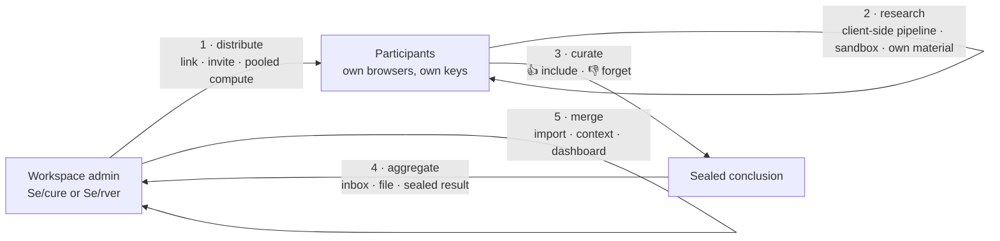

# Workspaces — the complete specification

*(2026-07-25, owner directive. Workspaces are the centre of the product:
everything else — the pipeline, the sandbox, the grants, the SDKs — is
machinery a workspace uses. This document is the single specification of both
kinds, the vocabulary rule, the data-exposure ledger, and the two workspace
surfaces specified here ahead of the code: the **arrival disclosure** (§6) and
**message-level curation** (§7).)*

Companions: `docs/WORKSPACE-SECURITY.md` (the Se/cure link's security
architecture), `docs/WORKSPACE-PROTOCOL.md` (DRSW/1, the interchange
standard), `docs/CROWD-RESEARCH.md` (DRCR/1, distributed campaigns),
`docs/COMPUTE-SHARING.md` §9b (workspace knowledge as built),
`docs/PRIVACY-MODEL.md` (invariant 4 in full), `docs/ARCHITECTURE.md` §0 (the
board).

---

## 0. Vocabulary — one noun, two kinds

**A workspace is a named place where research happens.** It holds material
(files, notes), conversations, configuration, and a set of capabilities. That
is the only noun. The two kinds differ in where the workspace lives and who
can read it:

| | DeepResearch.**Se/cure** workspace | DeepResearch.**Se/rver** workspace |
|---|---|---|
| Lives in | one **link** — the URL fragment holds the whole thing | one **account** — a record in the browser and in R2 |
| Server's role | serves static files; sees nothing of the workspace | stores it, indexes it, runs the pipeline over it |
| Opened by | link + password (out-of-band) | signing in |
| Admin | whoever minted the link | the account that owns it |

**The rename (2026-07-25 owner directive).** The Se/rver tier's "project" is
a workspace and is called one. This is a DISPLAY rule with the same shape as
the DRC/DRS rule in `docs/BRANDING.md`:

- **User-facing copy says workspace** — UI labels, help text, notices,
  prompts, docs, commit-message prose aimed at readers.
- **Code identifiers and wire paths do not move.** `src/storage.js`'s
  `/api/projects*`, R2 `projects/{uid}/…`, `public/js/projects.js`,
  `project-context.js`, the `projects` IndexedDB store, the `project` field in
  a `drskn` bundle — all stay. Renaming a live route or a stored record's
  shape buys nothing and breaks existing data.
- Where a doc must talk about the stored artifact rather than the concept, say
  **workspace record** and name the identifier once: *the workspace record
  (`projects/{uid}/{id}`)*.
- The plain word "project" survives only for the repository itself ("this
  project is a research and innovation project") and in the compound **project
  vault** (`src/vault.js`), whose endpoint and blob name are user-visible.
  Prefer **workspace vault** in prose that isn't naming the endpoint.

Secure-first ordering (`docs/BRANDING.md`) governs every pairing in this
document: Se/cure first, then Se/rver.

---

## 1. Why workspaces are the centrepiece

The project's mission, stated as an architecture, is **the DeepResearch
security architecture**: how research can be *distributed outward* to people
and machines you do not control, and how insight can be *aggregated back*,
with the data exposure of every hop written down rather than assumed.

A workspace is where that happens, because a workspace is the unit that
travels:



Every arrow is a place where data could leak, and each one has an answer in
this document: §3 and §4 say what a workspace holds, §5 says what each
distribution and return channel exposes, §6 says how the participant is *told*
which of those they are standing in, and §7 says how they control what they
contribute.

The two kinds are two honest answers to the same question, not a good option
and a bad one:

- **Se/cure** buys structural privacy — the server cannot read what it never
  receives — and pays for it in capability: no cloud index, no server-side
  enrichments, no account, no cross-device sync unless you carry the link.
- **Se/rver** buys capability — cloud storage, a real vector index, the
  server-side enrichments, orchestration across sub-agents — and pays for it
  in exposure: it is **cloud-first, and not everything can be encrypted**,
  because retrieval and orchestration need plaintext.

What keeps the Se/rver bargain defensible is the smallness of what you must
trust: **one service provider** (Cloudflare — one Worker, D1, R2, Vectorize),
**one deployment path** (a push to `main` in a public repository), and **a
very simple orchestration architecture** (a deterministic pipeline with no
function calling, invariant 1; sub-agents run as plain parallel waves of that
same pipeline). There is no queue cluster, no third-party analytics, no
vendor mesh to audit. §4.7 states that bargain in full.

---

## 2. The two kinds at a glance

| Property | Se/cure workspace | Se/rver workspace |
|---|---|---|
| Address | `https://deepresearch.se/cure/workspace#w=<blob>` | account + workspace id (`projects/{uid}/{id}`) |
| Where the record rests | in the link only; the opened copy lives in browser storage under the master key | AES-256-GCM ciphertext in IndexedDB **and** in R2 |
| Who holds the key | the link holder (password → KDF, `docs/WORKSPACE-SECURITY.md` §2) | the server derives it per user from `HISTORY_KEY_SECRET`; never stored beside the ciphertext |
| Server can read the record | **no** — the fragment never reaches it | **yes, by re-deriving the key** — this is the tier's honest cost |
| Readable by design | nothing | RAG-indexed material and workspace chats (retrieval needs plaintext) |
| Conversations | client-side pipeline on the user's own/local provider, or borrowed grants | `/api/chat` — full server pipeline, logged in `chat_logs` unless `incognito` |
| Material / files | in the browser (OPFS), optionally mounted into the sandbox | R2 `files/{uid}/…`, RAG-indexed into Vectorize |
| Retrieval | browser index (IndexedDB, local cosine top-k) | Vectorize, scoped to the workspace's doc ids |
| Server-side enrichments (Shodan, Maps, Nominatim, HF) | **not available** — each is a server-side key in a server data path | available, per-knob |
| In-browser Linux (CheerpX) | yes | yes |
| On-device model (WebGPU) | yes | yes |
| Borrowed capabilities | web-search grant, `api` proxy grant, Se/rver token, pool token | not needed — the account has them |
| Aggregation inbox | seals conclusions outward (§5.2) | receives and imports them (§8) |
| Revocation | quota to 0 or delete the grant row; the link itself cannot be recalled | delete the record; `DELETE /api/storage` wipes the account |
| Costs money to whom | the participant (own key) or the admin (metered grant) | the account owner |

---

## 3. Se/cure workspace — complete specification

### 3.1 Identity and addressing

The link **is** the workspace. There is no id, no row, no server-side record.
Everything after `#` is the fragment: browsers do not send it in requests and
strip it from referrers, so the server that serves `/cure/workspace` never
sees the ciphertext, let alone the plaintext.

```
https://deepresearch.se/cure/workspace#w=<base64url( salt(10) ‖ nonce(10) ‖ ciphertext )>
```

Two entry states, both at the same path:

- **no fragment** → the *share composer* over the current session (mint).
- **`#w=…`** → the *unlock* flow (open). On success the app strips `#w=` from
  the address bar and fires the arrival disclosure (§6).

The password is never in the link and travels by a different channel. The KDF
is 8192 SHA-512 rounds; the generated default password is 12 alphanumeric
characters (~71 bits). The envelope, the dual-key derivation, and the
threat model are specified in `docs/WORKSPACE-SECURITY.md` §2–§5 and
normatively in **DRSW/1** (`docs/WORKSPACE-PROTOCOL.md` §3); they are not
repeated here.

### 3.2 Section registry — what a workspace can carry

A workspace payload is a JSON object of independent **sections**. Each is
opt-in at mint time, each has its own exposure class, and a reader ignores
sections it does not know (DRSW/1 §4).

| Section | Contents | Written by | Read by | Exposure if link + password leak |
|---|---|---|---|---|
| `keys` | the minter's own provider keys + provider/model choice | share composer | Se/cure settings | **full use of those keys until rotated** — the composer warns explicitly |
| `settings` | research knob, sandbox, introspection, web-search backend config | share composer | Se/cure settings | configuration only (may include a self-hosted search key) |
| `conversations` | plain chat turns | share composer | history pane (appended with fresh ids, never clobbering) | the shared conversations, nothing else |
| `grants.ws` | a `wsk1.…` web-search grant | Se/rver mint or admin | grant intake | a bounded, metered number of server-paid searches |
| `grants.proxy` | `prg1.…` grant tokens (`web`, `api`) | Se/rver mint or admin | grant exchange | a bounded, metered allowance on the minter's account |
| `grants.token` | a consolidated Se/rver token (HS256 JWT, `perms`) | Se/rver mint | grant intake | same two upstream services, one ticket (`docs/SERVER-TOKENS.md`) |
| `grants.pool` | a `pt1.…` pool token | Se/rver sharer | model dropdown ("Shared compute") | completions run on **the pool owner's machine**, who can read them |
| `campaign` | DRCR/1 invite: organizer public key, alias, seeded task | campaign composer | campaign pane | the task and the organizer's *public* key — no read capability |
| `origin`, `route`, `provenance`, `pipelines`, `materials` | DRSW/1 interchange extensions | interchange nodes | conforming readers | see DRSW/1 §5 |

Two token rules that hold for every section (`docs/WORKSPACE-SECURITY.md` §3):

1. **Only URL-safe tiers travel.** Grant-granting tokens (`wsk1`, `prg1`, the
   Se/rver JWT, `pt1`) ride the fragment; working proxy tokens (`prx1`) never
   appear in a URL and are obtained by exchange.
2. **The workspace opens offline; grants hydrate opportunistically.** Keys,
   settings and chats apply with no network at all. A revoked or expired grant
   simply fails to connect — never an error that blocks the open.

### 3.3 Capabilities

What a Se/cure workspace can do, and what powers it:

| Capability | Powered by | Server in the path? |
|---|---|---|
| Deep research pipeline (triage → harvest → gap → synthesis → validation) | `public/js/drc-research.js`, client-side | no |
| Answers from the user's own provider | browser-direct to OpenAI / Groq / Berget with the user's key | no |
| Answers with no third party at all | the keyless `local` provider (Ollama / LM Studio / llama.cpp) | no |
| Answers on a downloaded model | WebGPU + OPFS weights (`docs/BONSAI-27B-PHONE-INFERENCE.md`) | no |
| Live web search | the metered web-search grant (query only) | **yes — query only**, exception 1 |
| Borrowed completions and embeddings | the `api` proxy grant / Se/rver token | **yes — content**, exception 2, disclosed in the UI |
| Peer compute | a pool token; the answer runs on the pool owner's machine | **yes — relayed**, `docs/COMPUTE-SHARING.md` §7 |
| Retrieval over own material | browser RAG index (IndexedDB, cosine top-k) | no (embeddings need a grant) |
| In-browser Linux | CheerpX VM, files mounted from the browser | no |
| Publishing a frozen replay | `src/pub.js`, an explicit act | yes — the published replay is public |
| Contributing conclusions back | sealed `drskn` bundle (§5.2) | depends on the return channel |
| Server-side enrichments (Shodan, Google Maps, Nominatim, HF) | — | **not offered**: each needs a server-side key in a server data path |

### 3.4 Where the bytes rest

| Artifact | At rest | Encrypted | Key held by |
|---|---|---|---|
| the link blob | wherever the link was sent | yes (AES-256-GCM) | the password holder |
| opened workspace state (chats + keys) | browser storage (`public/js/drc-store.js`) | yes | the user's master secret |
| attached files | browser (OPFS) | as the store holds them | the user |
| browser RAG index | IndexedDB | no — retrieval needs plaintext chunks | the browser only |
| sandbox volumes | IndexedDB (CheerpX overlay) | no | the browser only |
| grant meters | D1 on the server | n/a — counters and a `jti`, no content | the server |
| a published replay | R2 `pub/{slug}` | no — publishing is the point | public |

### 3.5 Exposure ledger

Read this as *"what does an attacker get, given exactly this"*:

| An attacker who has… | …gets |
|---|---|
| the link alone | ciphertext; must pay 8192 SHA-512 rounds per password guess |
| the password alone | nothing — it locates nothing |
| link + password | every section that was ticked at mint (§3.2's last column) |
| the server's logs and storage | nothing about the workspace itself: the fragment never arrived. Grant *meters* show a `jti`, counts, and timing |
| a grant token from the link | a bounded, metered allowance the admin can pause (quota 0) or revoke instantly |
| an `api` grant and the server | the prompts and documents sent through that grant — this is the disclosed exception |
| a pool token and the pool owner's machine | everything sent to the shared model — stated unmissably at the point of use |
| script execution in the `/cure` origin | everything the page can reach (out of scope here, as in hacka.re's spec; tracked in `SECURITY-RISKS.md`) |

### 3.6 Lifecycle

1. **Mint** — the composer projects the ticked sections of the current
   session into a payload, seals it under the password, and shows the link.
   Nothing touches the server. From Se/rver, the account can mint grants
   first; the server issues tokens but never sees the password or the
   assembled link.
2. **Deliver** — link and password through different channels.
3. **Open** — password → link key → payload. Structure is validated
   (`validateWorkspacePayload`); conversations are appended, never merged over
   local data. The address bar is cleaned. **The arrival disclosure fires
   (§6).**
4. **Work** — the participant researches on their own terms, in their own
   browser.
5. **Return** — curated conclusions leave sealed (§5.2, §7).
6. **Revoke** — the link cannot be recalled; what *can* be withdrawn is every
   capability it carries. `POST /api/websearch/adjust` and
   `POST /api/proxy/adjust` (self-service, minter-scoped) or the admin PATCH
   routes move a grant row's quota, including to **0 = paused**; deleting the
   row kills it instantly. This is why capabilities are metered rows rather
   than bearer amounts (`docs/WORKSPACE-SECURITY.md` §4).

---

## 4. Se/rver workspace — complete specification

### 4.1 Identity and addressing

A Se/rver workspace belongs to an account. It is identified by a workspace id
inside that account, and it exists in two places at once: the browser's
`projects` IndexedDB store and R2 `projects/{uid}/{id}`. Both hold the same
`{iv, ciphertext}` blob; `public/js/sync.js` reconciles them.

There is **no cloud-storage switch**. Cloud storage is implicit on this tier
(2026-07-16 owner directive): the *tier* is the choice. Work that must stay
out of any cloud belongs in a Se/cure workspace, where the server is in no
data path at all.

### 4.2 What the record holds

| Part | Contents | Where | Readable to the server |
|---|---|---|---|
| record | name, file inventory with extracted metadata, notes | IndexedDB + R2 `projects/{uid}/{id}` | by key re-derivation |
| conversations | the workspace's chats | IndexedDB + R2 `convos/{uid}/…`; **workspace chats are stored readable** because they are RAG-indexed | yes, by design for indexed chats |
| file originals | the uploaded bytes | R2 `files/{uid}/…` — **readable**: the server serves them back and extracts document text | yes, disclosed in the settings UI |
| RAG index | chunk text + vectors | Vectorize (+ R2 `rag/{uid}/…` export copies) | yes — retrieval needs plaintext |
| image material | not indexable; contributes EXIF/GPS metadata to chat context | with the record | yes |
| vault archive | the whole workspace as one blob | R2 `vault/{uid}/{id}` | **no** — §4.6 |

Scope is the invariant the code protects: a chat inside a workspace retrieves
across *that* workspace's indexed documents, its sibling chats, and its own
attachments — never another workspace's. Retrieval is by explicit doc-id list,
so isolation is structural, and the e2e suite asserts it.

Caps that matter in practice: 100 files per workspace, 25 MB per file input,
8 M characters parsed per document.

### 4.3 The readable exceptions, stated plainly

Conversations and attached-file originals rest as ciphertext in both the
browser and R2. **The only readable exceptions are RAG-indexed material and
workspace chats** — because retrieval needs plaintext, and a vector index over
ciphertext retrieves nothing. Plus two deliberate readable stores that are not
about retrieval at all:

- **`chat_logs`** — the full-visibility interaction log (2026-07-08 product
  decision): every completed exchange's question, answer, and research
  metadata, unless the request carries `incognito: true`.
- **`feedback`** — user content stored readable by explicit user action.

The encryption key for everything else is derived server-side per user via
HMAC-SHA-256 from the `HISTORY_KEY_SECRET` Worker secret and held only in
memory. The server can re-derive it; it never stores it beside the ciphertext,
so compromise of the R2 bucket alone reveals nothing. Without the secret,
`GET /api/history-key` returns 503 and the client hides history rather than
storing plaintext.

### 4.4 Capabilities

Everything a Se/cure workspace can do, plus:

| Capability | Powered by |
|---|---|
| The full server pipeline | `src/chat.js` + `src/pipeline.js` — split model routing (planning phases pinned to `DEFAULT_MODEL`, synthesis on the chosen model, invariant 3) |
| Live web search | Exa on the server's key — no grant needed |
| Vector retrieval at scale | Vectorize, scoped to the workspace's doc ids |
| Shodan host intelligence | `shodan_mcp` knob, `src/shodan.js` |
| Google Maps / Street View | `google_maps` knob, `src/googlemaps.js` |
| Reverse geocoding of photo GPS | OSM Nominatim, `src/geocode.js`, automatic |
| Hugging Face Hub as a source | `hfIntent`, `src/hf.js` |
| Sub-agent orchestration | Orchestrator mode — one JSON plan phase, then parallel waves of the same pipeline |
| Agent Studio | SDK mode — distils this site into an agent or a platform, publishes at `/app/<slug>/` |
| The pipeline as a tool | `POST /mcp` — `deep_research` + the `sdk_*` tools |
| Answer recovery across a dropped connection | D1 `answers`, minutes of retention |
| Aggregation inbox | `/api/knowledge*` — §8 |
| Lending capability outward | minting grants and workspace links (§3.2) |
| Sharing local compute | pool provider mode (`docs/COMPUTE-SHARING.md`) |

### 4.5 Exposure ledger

| An attacker who has… | …gets |
|---|---|
| the R2 bucket alone | ciphertext for records and conversations; **plaintext** for file originals, RAG exports, and indexed workspace chats |
| the R2 bucket + `HISTORY_KEY_SECRET` | the encrypted records and conversations too |
| Vectorize | chunk text and vectors for indexed material |
| D1 | accounts, quotas, config, grant meters, alerts, game saves, and `chat_logs` — the full text of every non-incognito exchange |
| Workers Logs | counts, durations, statuses, token usage. User text only at `debug`; secrets never |
| the vault object | ciphertext only — the server cannot derive its key (§4.6) |
| a Se/rver token | **nothing stored** — it opens upstream services only, is never a login, and its one write is Se/cure feedback (`docs/SERVER-TOKENS.md`) |

### 4.6 The vault — the strictest sub-tier

The vault packs one whole workspace — record, chats, decrypted file
originals, and the RAG index with vectors — into a single blob the server only
ever sees as ciphertext. Both the R2 object id **and** the AES-256-GCM key are
derived in the browser (HKDF) from a copy-safe 160-bit secret the user holds;
the server receives neither and can derive neither
(`public/js/vault-core.js`). So a browser-only workspace gains backup and
cross-device transport as pure ciphertext.

Unlike the implicit cloud copy, each vault store is its own explicit consent
act — and vault objects are excluded from the account-wide wipe. Endpoints:
`PUT/GET/DELETE /api/vault/:id`, R2 `vault/{uid}/{id}`.

### 4.7 Cloud-first, and what that buys

The Se/rver tier does not pretend to be end-to-end encrypted, and the design
does not try to argue its way there. The honest statement is three sentences:

1. **It is cloud-first.** Storage, retrieval, orchestration, and the research
   pipeline run server-side. Some of that must be plaintext — a vector index
   over ciphertext retrieves nothing, and a pipeline cannot reason over bytes
   it cannot read.
2. **The trust surface is one provider and one path.** One Cloudflare Worker
   at the edge with D1, R2 and Vectorize behind it; no origin server, no
   database cluster, no analytics vendor, no third-party queue. The code is
   git-connected to a public repository, so what production serves is what the
   repository shows (`docs/ARCHITECTURE.md` §9's serving-chain claim). The
   root of trust is therefore auditable in one sitting: the repo and the
   Cloudflare account.
3. **The orchestration is deliberately simple.** No function calling
   (invariant 1), no agent framework, no message bus. Every phase is a direct
   JSON-mode or streamed call; sub-agents are parallel waves of the same
   pipeline; helper phases fail soft rather than breaking a request
   (invariant 2). Simple orchestration is a *security* property here: there is
   no dynamic tool graph to reason about, so what a request can reach is
   decided by code you can read, not by a model's choice at runtime.

Inside the Se/rver tier the server is **inside the trust boundary** (owner
directive, 2026-07-24). Agents collaborating and orchestrating over
server-side storage is the intended direction, not an exception to argue past.
The hard pass-through rules exist to protect **Se/cure**, which has no account
and no server-side state — that is what the Se/rver-token guarantee is for
(`docs/PRIVACY-MODEL.md`).

### 4.8 Lifecycle

Create → add material (files, notes; indexable material is always indexed) →
chat inside the workspace (retrieval scoped to it) → optionally distribute
(§5.1) → aggregate returns (§8) → archive to the vault, or delete. Deleting a
workspace removes its record, its chats, its files and its index entries;
`DELETE /api/storage` wipes the account's cloud copies, vault objects
excluded.

---

## 5. Distribution and aggregation

This is the security architecture proper: how research leaves the admin, and
how findings come back.

### 5.1 The three outbound channels

| Channel | What travels | Who pays | What the server sees | Spec |
|---|---|---|---|---|
| **Workspace link** | a whole configured session: settings, chats, optionally keys and metered grants | the minter, for whatever grants ride along | nothing of the link; only grant meters as they are spent | §3, `docs/WORKSPACE-SECURITY.md` |
| **Campaign invite** (DRCR/1) | a workspace carrying a `campaign` section: the organizer's **public** key, an alias, the seeded task | the participant, on their own keys | nothing — invites and results are client-sealed | `docs/CROWD-RESEARCH.md` |
| **Pooled compute** | a `pt1` pool token that puts the admin's local model in the participant's model list | the admin, in their own GPU time | the relayed completion body while the job runs — held, never stored or logged | `docs/COMPUTE-SHARING.md` |

### 5.2 The three inbound channels

A **conclusion** is the unit that comes back: one curated exchange, packaged
as `{ context summary, query, reply-as-blocks }` (`public/js/knowledge-core.js`).

| Channel | Envelope | Recipient key lives | Server can read it | Use when |
|---|---|---|---|---|
| **Server inbox** (default) | `drskn-bundle` — ECIES: ECDH P-256 → HKDF-SHA-256 → AES-256-GCM | in D1 (`knowledge_agent`) — the site's import agent | **yes, at the owner's import** | the admin wants one place to collect from many participants |
| **`.drskn` file** | the same envelope, downloaded | same | yes, when the owner uploads it | no live token, or out-of-band delivery is preferred |
| **DRCR/1 sealed result** | `drcr` result envelope, same suite, different frozen HKDF info so the two can never cross-open | **in the organizer's browser** | **no** | the finding must be unreadable to the server |

The `drskn` posture is stated rather than softened: the import agent's private
key lives in D1, so the server *can* decrypt those envelopes. What the seal
buys is real but bounded — the conclusion rests as ciphertext (a leaked inbox
dump is unreadable without the agent row), plaintext exists server-side only
in the moment the owner asks for an import and is returned only to them, and
nothing about a conclusion is ever logged beyond ids and sizes. **For
knowledge the server must never be able to read, the DRCR/1 campaign path is
the tool**, and the arrival disclosure (§6) says so in the participant's own
words before they contribute anything.

---

## 6. The arrival disclosure — popover and animation

**Status: specified here, not yet implemented.** Today Se/cure pops a privacy
notice on workspace arrival (`showPrivacyNotice()` in `public/cure/drc.js`,
2026-07-16 owner directive) and appends pooled-compute lines when a pool token
is present. This section generalizes that into one component, covering both
kinds and both directions of data flow.

### 6.1 The requirement

> When a user enters a workspace, tell them — with a popover and a short
> animation — **which kind of workspace this is** and **how what they do here
> aggregates back to the workspace admin**.

Two facts, in that order, before any research happens.

### 6.2 Triggers

| Trigger | Fires |
|---|---|
| a Se/cure workspace link opens (`#w=` unlocked) | always |
| a campaign invite opens | always, with the campaign lane |
| a pool token connects | always, with the pooled-compute lane |
| the participant opens a Se/rver workspace they do **not** own (shared or delegated) | always |
| the owner opens their own Se/rver workspace | first time per workspace, then on change |
| the workspace's capability set changes (a grant arrives, compute connects, aggregation is switched on) | re-fires with only the changed lanes highlighted |
| the (i) affordance on the header wordmark | on demand, any time |

Suppression is per workspace **and per capability set**, never global. The
persisted key is `dr_ws_notice:<workspaceKey>` holding
`{ v, shownAt, capsHash }`, where `capsHash` is a stable hash over the sorted
capability ids of §6.4. A new capability changes the hash and the popover
returns. There is no "never show again" — the disclosure is the price of the
capability.

### 6.3 Anatomy

```
┌────────────────────────────────────────────────┐
│  ◐  SE/CURE WORKSPACE            "Nordics Q3"  │   kind badge + name
├────────────────────────────────────────────────┤
│   [ you ] ──▸ [ this browser ] ──▸ [ admin ]   │   the flow strip (animated)
│                                                │
│  • Your research runs in this browser.         │   one line per lane
│  • Web search is borrowed: only the query      │
│    leaves, metered by the admin.               │
│  • Nothing goes back to the admin unless you   │
│    press 👍 on a reply.                         │
├────────────────────────────────────────────────┤
│  [ What the admin receives ]   [ Start ]       │   actions
└────────────────────────────────────────────────┘
```

- **Kind badge** — the workspace kind, direct-labeled in words, never colour
  alone (`Se/cure workspace` in the khaki tier palette, `Se/rver workspace` in
  flag blue). Se/cure-first ordering applies wherever both are named.
- **Flow strip** — three to five nodes, one per hop the data actually takes,
  built from the live capability set (§6.4), not a fixed picture.
- **Lane lines** — one sentence per capability, in the participant's language.
- **Actions** — *What the admin receives* expands the aggregation detail
  (§6.6); *Start* dismisses. Escape and backdrop click dismiss; nothing is
  destructive.

### 6.4 The capability lanes

Each lane is a data-flow fact, derived from state, with its own copy. The
popover renders the lanes that apply, in this order:

| id | Condition | Flow strip | Line (EN) | Line (SV) |
|---|---|---|---|---|
| `local` | Se/cure, own or local provider | you → this browser | Research runs in this browser, on your own key. | Efterforskningen körs i den här webbläsaren, med din egen nyckel. |
| `ondevice` | a downloaded model is selected | you → this device | The model runs on this device. Nothing reaches any provider. | Modellen körs på den här enheten. Ingenting når någon leverantör. |
| `search-grant` | a web-search grant is live | you → deepresearch.se → Exa | Web search is borrowed from the admin: only the search query leaves this browser, and it is metered. | Webbsökning är lånad av administratören: bara sökfrågan lämnar webbläsaren, och den mäts. |
| `api-grant` | an `api` grant / Se/rver token is live | you → deepresearch.se → Berget | Answers are borrowed: **your prompts and documents pass through deepresearch.se** to Berget. | Svaren är lånade: **dina frågor och dokument passerar deepresearch.se** till Berget. |
| `pool` | a pool token is live | you → deepresearch.se → the admin's machine | Shared compute: prompts you send to the shared model run on the admin's machine, and **the admin can read everything you send**. | Delad beräkning: frågor till den delade modellen körs på administratörens maskin, och **administratören kan läsa allt du skickar**. |
| `server-tier` | Se/rver workspace | you → deepresearch.se → storage | This workspace is stored in the cloud. Conversations and files rest encrypted; indexed material and this workspace's chats rest readable, because search needs them readable. | Det här arbetsytan lagras i molnet. Konversationer och filer vilar krypterade; indexerat material och arbetsytans chattar vilar läsbara, eftersom sökning kräver det. |
| `chatlog` | Se/rver, not incognito | — | Completed exchanges are kept in the site's interaction log for debugging. | Avslutade utbyten sparas i sajtens interaktionslogg för felsökning. |
| `aggregate-inbox` | conclusions can be passed to an inbox | you → sealed → admin | What you press 👍 on is sealed and sent to the admin's inbox. **The site can decrypt it when the admin imports it.** | Det du markerar med 👍 förseglas och skickas till administratörens inkorg. **Sajten kan avkryptera det när administratören importerar.** |
| `aggregate-campaign` | a DRCR/1 campaign section is present | you → sealed → organizer | Your conclusion is sealed to the organizer's own key. **The site cannot read it.** | Din slutsats förseglas till organisatörens egen nyckel. **Sajten kan inte läsa den.** |
| `aggregate-none` | no return channel configured | you ✕ admin | Nothing you do here goes back to anyone. | Ingenting du gör här går tillbaka till någon. |

Both languages ship together in the same change, with a parity unit test —
invariant 6, no English-only with Swedish later.

### 6.5 The animation

The flow strip animates once, then rests:

1. **0 ms** — nodes fade in left to right, 90 ms apart.
2. **300 ms** — a token (a small filled dot) travels each edge in sequence,
   220 ms per edge, `cubic-bezier(.4,0,.2,1)`.
3. **On arrival at a server node** the node pulses once and its label reveals
   what stops there ("query only", "prompt + documents", "sealed").
4. **The return edge** (aggregation) draws in the opposite direction, dashed,
   after the forward pass — so "out" and "back" are visually distinct without
   relying on colour.
5. **Rest state** — the token parks at the last node; the strip stays readable
   as a static diagram.

Hard rules:

- `@media (prefers-reduced-motion: reduce)` → no token travel, no pulse; the
  strip renders in its rest state immediately. The information is in the
  labels; the animation only paces reading.
- Total runtime ≤ 1.6 s, and the **Start** button is enabled from the first
  frame. The animation never gates the dismissal.
- No colour-only meaning anywhere: every node and edge carries a word.
- The strip is `aria-hidden` and duplicated as an ordered list for screen
  readers; the popover is a focus-trapped `role="dialog"` with
  `aria-labelledby` on the kind badge.

### 6.6 "What the admin receives"

The expandable half answers the second requirement — *how data is aggregated
back*. It states, for the live configuration:

- **What is sent**: nothing by default; only exchanges the participant marks
  👍, curated per §7.
- **What travels with it**: the context summary, the question, the kept
  blocks. Never the workspace's keys, never other conversations, never files
  that were not part of a marked exchange.
- **Who can read it**: the admin always; the site's import agent too, when the
  inbox channel is used (§5.2), and not at all on the campaign channel.
- **When**: at the moment the participant presses Send in the curation pane —
  never in the background.
- **What is forgotten**: everything marked 👎 (§7.6), including from the
  context of what *is* sent.

### 6.7 Implementation map

| Piece | Module | Note |
|---|---|---|
| lane derivation + copy | `public/js/workspace-notice-core.js` (new, pure) | takes a capability snapshot, returns `{ kind, name, lanes[], strip[] }`; Node-testable, EN+SV tables live here |
| popover rendering | `public/js/workspace-notice.js` (new) | dialog, focus trap, animation, reduced-motion branch |
| Se/cure wiring | `public/cure/drc.js` | replaces `showPrivacyNotice()`'s body; keeps the (i) affordance |
| Se/rver wiring | `public/js/projects-ui.js` + `public/js/app.js` | fires on workspace open |
| pooled-compute copy | `public/js/pool-core.js` | `poolDataFlowNotice()` becomes one lane's source |
| styles | `public/css/…` + `public/cure/drc.css` | tier palettes, both direct-labeled |

### 6.8 Test plan

- Unit (`workspace-notice-core.test.js`): lane selection for each capability
  combination; `capsHash` stability and change detection; **EN/SV parity** —
  every lane id has both strings, asserted by iteration, not by a hand-written
  list.
- Unit: the aggregation lane is `aggregate-none` unless a return channel is
  actually configured (fail-closed copy: never promise privacy that the
  configuration does not provide).
- e2e (mocked): opening a `#w=` link shows the popover before the composer is
  usable; Escape dismisses; the (i) reopens it; a grant arriving re-fires it.
- e2e: with `prefers-reduced-motion`, no animation frames run and the strip is
  complete on first paint.

---

## 7. Message-level curation — 👍 include, 👎 forget

**Status: specified here; the block-level half of it ships today.**
`public/js/knowledge-core.js` already implements curation at the level of
**blocks inside one reply** (`plus` / `neutral` / `minus`, with a pure reducer
and full undo/redo). This section specifies the same model one level up — at
the level of **messages in a conversation** — which is what makes a workspace
contribution more than a single answer.

### 7.1 The model

Every message in a workspace conversation carries a mark:

| Mark | Set by | Meaning | Rendering |
|---|---|---|---|
| `neutral` | default | eligible as context, not itself a contribution | normal |
| `plus` | 👍 | **explicit inclusion**: this message is contributed, and the relevant context around it comes with it | highlighted, with an "included" affordance |
| `minus` | 👎 | **forgotten**: excluded from the contribution *and* from the context of everything else | greyed out, still readable, with an undo affordance |
| `hidden` | 👎 again | removed from view as well | not rendered; recoverable only through undo or the hidden-items count |

The progression is deliberate and one-directional per press:
`neutral → minus → hidden`. 👍 on a `minus` or `hidden` message restores it
straight to `plus`. 👍 on a `plus` message returns it to `neutral` (the
existing toggle semantics — a second tap undoes the first).

```
        👍                👍                👍
  ┌─────────────┐   ┌─────────────┐   ┌─────────────┐
  │             ▼   │             ▼   │             ▼
neutral ──👎──▸ minus ──👎──▸ hidden ──👍──▸ plus ──👍──▸ neutral
```

### 7.2 What 👍 actually includes — the context closure

"Plus all relevant context" is a precise operation, not a vibe. For a
thumbed-up assistant message `m` in conversation `C`, the contribution is the
closure:

1. **The message itself** — `m`, split into blocks by `splitBlocks`, so the
   existing ± block curation applies inside it unchanged.
2. **Its question** — the nearest preceding `user` message.
3. **Tool-call results attached to that exchange** — search results actually
   cited, sandbox transcripts, source excerpts, enrichment outputs
   (`activity` records bound to `m`). These travel as their own blocks so they
   can be curated or dropped individually.
4. **The conversation before it**, compressed by `summarizeContext` — the
   deterministic client-side summary (last turns, one line each, editable
   before sending). No model call: the closure must work offline and cost
   nothing.
5. **Workspace material referenced by the exchange** — by *name and id only*,
   never file bytes. A conclusion is prose, not an archive.
6. **Other 👍 messages in the same conversation** are contributed as their own
   conclusions in the same bundle, not nested inside each other.

Then subtract:

7. **Every `minus` and `hidden` message is removed** from steps 2–4 before the
   summary is computed — not merely filtered from display. The summary of a
   conversation containing a 👎 message is byte-identical to the summary of
   the same conversation with that message deleted. This is the load-bearing
   property of "forgotten", and it is the one test that must never be allowed
   to rot.

### 7.3 Interaction rules

- The 👍/👎 pair appears on every stored message in a workspace conversation.
  Outside a workspace they are absent — there is nowhere to contribute to.
- 👍 opens the **curation pane** over the built conclusion (the pane that
  exists today), so block-level ± and message-level marks compose: the message
  decides *whether* it travels, the blocks decide *what of it* travels.
- Undo/redo covers marks and block tags in one history, through the same pure
  reducer. A mis-tap never loses work — including the second 👎 that hid a
  message.
- A hidden-items counter ("3 hidden · show") sits at the end of the
  conversation. Showing them renders them in the `minus` style with restore
  affordances; it does not change any mark.
- Nothing is sent by pressing 👍. Sending is a separate, explicit act in the
  curation pane.

### 7.4 Data model

Marks live beside the conversation, keyed by message id, never inside the
message text:

```js
// conversation record → marks
{ marks: { "<messageId>": "plus" | "minus" | "hidden" }, marksV: 1 }
```

- **Se/cure**: the marks ride in the sealed local store with the conversation
  (`drc-store.js`), and — when a workspace is re-sealed for hand-off — in the
  `conversations` section, so curation survives a hop (DRSW/1 readers ignore
  the field if they do not know it).
- **Se/rver**: the marks live in the conversation record, encrypted with it.
- Absent marks read as `neutral`; an unknown value reads as `neutral`. The
  field is additive and never required.

### 7.5 Feeding aggregation

`buildConclusion` gains a marks-aware caller: given `(conversation, index,
marks)` it produces exactly the closure of §7.2. `finalizeConclusion` is
unchanged — it already drops `minus` blocks entirely — and
`conclusionToContext` still renders summary → question → key points → body, so
everything downstream (the admin's Copy-as-context, the DRCR result plaintext)
works without a change.

New pure functions, all in `public/js/knowledge-core.js` so both tiers share
them:

| Function | Contract |
|---|---|
| `markMessage(marks, id, action)` | `action` ∈ `{"up","down"}`; returns a new marks map per §7.1's machine. Pure, total, never throws |
| `visibleMessages(messages, marks)` | messages minus `hidden` — what the transcript renders |
| `contextMessages(messages, marks)` | messages minus `minus` and `hidden` — what any summary or prompt may see |
| `buildConclusionFrom(conversation, index, marks, opts)` | the §7.2 closure, returning a conclusion that `validateConclusion` accepts |

`contextMessages` is the seam that makes forgetting real: **every** path that
reads a conversation for the model — the client pipeline's history, the
summary, the retrieval query builder — goes through it. A path that reads
`conversation.messages` directly is a bug, and the unit test asserts the
callers.

### 7.6 What "forgotten" means at each layer

| Layer | Effect of 👎 | Effect of a second 👎 |
|---|---|---|
| transcript | greyed, still readable, restorable | not rendered; counted in "n hidden" |
| context for the next question | excluded | excluded |
| context summary in a conclusion | excluded, as if deleted | same |
| the contribution itself | never sent | never sent |
| local storage | still stored (undo must work) | still stored |
| cloud copy (Se/rver) | still stored | still stored |
| RAG index | **the message is removed from the chat index** on the next reindex | same |

Marks are a *curation* control, not a delete. Deleting is a separate,
irreversible action that already exists (delete conversation, delete
workspace, `DELETE /api/storage`), and the pane says so in one line so nobody
mistakes grey for gone.

### 7.7 Strings and accessibility

- Buttons carry text labels, not emoji alone: `aria-label="Include this
  answer in what goes back to the workspace admin"` /
  `"Forget this message"`, and on the second press
  `"Hide this message from view"`.
- Swedish parity in the same change: *"Ta med det här svaret i det som går
  tillbaka till arbetsytans administratör"*, *"Glöm det här meddelandet"*,
  *"Dölj det här meddelandet"*.
- State is announced with `aria-pressed` and a live-region confirmation
  ("Forgotten — removed from context"), so the grey-out is not the only signal.
- The hidden counter is a real button, keyboard reachable, never a
  hover-only affordance.

### 7.8 Test plan

- Unit: the full state machine — every mark × every action, including the
  restore paths and undo across a hide.
- Unit: **the forgetting property** — `summarizeContext(contextMessages(C,
  marks))` equals `summarizeContext(C_without_those_messages)`, byte for byte.
- Unit: the closure includes cited tool results and excludes material bytes.
- Unit: unknown/absent mark values degrade to `neutral` (forward
  compatibility).
- Unit: EN/SV parity over the label table.
- e2e: 👍 then Send produces a bundle whose plaintext contains no text from
  any 👎 message; second 👎 removes the row from the DOM; undo restores it.

---

## 8. Aggregation at the admin's end

The admin's view is the Se/rver panel's **Workspace knowledge** section
(`public/js/account-knowledge.js`, server half `src/knowledge.js`):

| Action | Endpoint | What the server does |
|---|---|---|
| list | `GET /api/knowledge` | returns **metadata only** — ids, sizes, arrival times. Ciphertext stays sealed |
| import | `POST /api/knowledge/import` | decrypts one entry with the agent key and returns the bundle **to the owner alone** |
| open an uploaded file | `POST /api/knowledge/open` | decrypts, then refuses to return plaintext unless the bundle's `owner` is the caller |
| delete | `DELETE /api/knowledge/:id` | drops the entry |
| copy as context | client-side | `conclusionToContext` — summary + question + key points, ready to paste into any chat or workspace |

Addressing and abuse limits: a submitted bundle is routed by the **token's**
pool claim (authoritative), an envelope is capped at 400 000 characters, and
the un-imported backlog is capped per owner, so a flooding token fills a
bounded shelf. Submission is revocation- and block-aware.

Where this is heading: the same inbox is the natural place for a **campaign
dashboard** (DRCR/1 §8 — merged results from many participants, the
Mentimeter-for-research model) and for a **workspace roll-up** — conclusions
imported straight into the receiving workspace's material so the next
question retrieves over them. Neither is built; both are why the return
envelope carries `workspace` and `from` fields already.

---

## 9. Invariant alignment

| Invariant | How workspaces hold it |
|---|---|
| 1 — deterministic orchestration, no function calling | nothing here introduces tool calling; curation is a pure reducer, the closure is deterministic |
| 2 — helper phases fail soft | a grant that will not connect, an unreachable inbox, a missing import key: all degrade to a lesser result, never a failed open or a broken chat |
| 3 — split model routing | unchanged; a workspace changes *which* material and keys a request uses, never which model plans it |
| 4 — the privacy split | Se/cure workspaces add **no** server data path (§3.1); their only server-touching contents are the existing, bounded, metered grant families. The `drskn` inbox is a Se/**rver** surface: the participant chooses it explicitly and is told the server can decrypt it (§5.2, §6.4) |
| 5 — minimal dependencies | one crypto suite reused across three seal families (workspace, campaign, knowledge), WebCrypto only, no added dependency |
| 6 — Swedish parity | every string in §6 and §7 ships EN+SV in the same change, with a parity test that iterates the table rather than listing cases |

---

## 10. Status — built, and specified ahead

| Piece | Status |
|---|---|
| Se/cure workspace envelope, mint, open, section registry | **built** — `public/js/workspace-core.js`, `public/cure/drc.js` |
| Grant families riding a workspace, quota adjust, revoke | **built** — `src/websearch.js`, `src/proxy*.js`, `src/server-token.js` |
| Se/rver workspace record, storage, RAG scoping, vault | **built** — `public/js/projects.js`, `src/storage.js`, `src/rag.js`, `src/vault.js` |
| Se/cure arrival privacy notice | **built**, narrower than §6 — `showPrivacyNotice()` |
| Block-level curation (± with undo/redo) and sealed transport | **built** — `public/js/knowledge-core.js` |
| Aggregation inbox and the owner's import view | **built** — `src/knowledge.js`, `public/js/account-knowledge.js` |
| DRSW/1 interchange, DRCR/1 campaigns | **specified**, deliberately ahead of the code |
| §6 arrival disclosure (both kinds, capability lanes, animation) | **specified here** |
| §7 message-level 👍/👎 marks, the context closure, forgetting | **specified here** |
| Campaign dashboard, workspace roll-up of imported conclusions | **not built**, §8 |

The vocabulary rename in §0 applies to prose immediately; the UI labels move
with the §6/§7 work, since that is when the affected surfaces are rebuilt
anyway.
